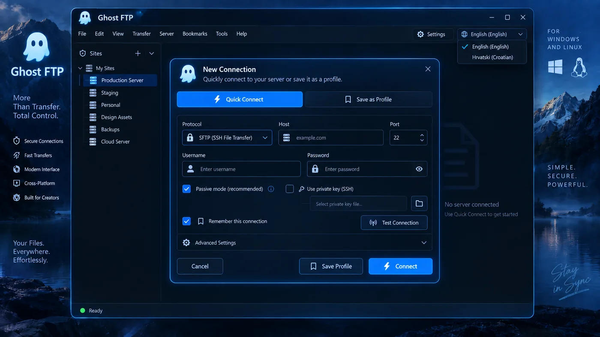
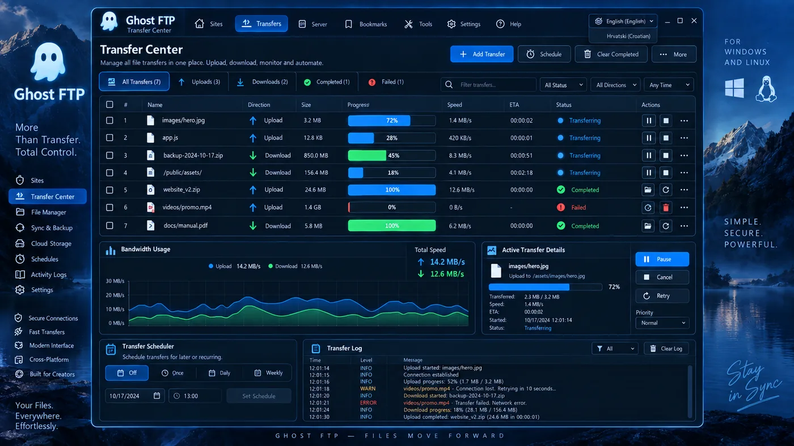
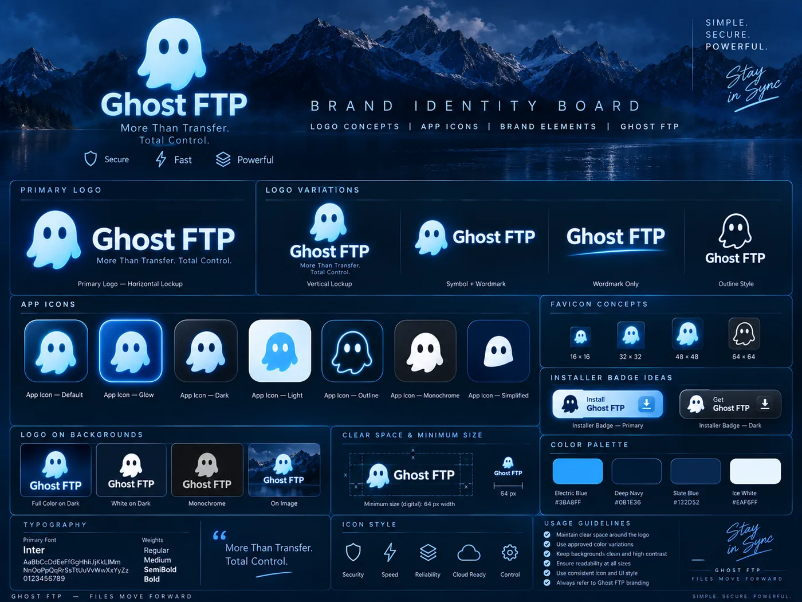

<div align="center">


### More Than Transfer. Total Control.

**Fast, private and powerful FTP / FTPS / SFTP for Windows and Linux.**

[Website](https://ghostftp.com/) ·
[Latest release](https://github.com/bren-wp/Ghost-FTP-Premium/releases/latest) ·
[Documentation](docs/README.md) ·
[Security](SECURITY.md) ·
[Changelog](CHANGELOG.md)

</div>

<p align="center">
  
</p>

## Ghost FTP

Ghost FTP is a privacy-first desktop file-transfer client designed for people who work with servers every day and want a cleaner, faster alternative to legacy FTP tools.

It combines a native desktop shell, a modern dual-pane file manager, saved server profiles, transfer queues, terminal and server tools, synchronization features, checksum and permissions workflows, secure credential storage, and a consistent Ghost FTP interface across Windows and Linux.

The production desktop application is built from the Ghost FTP desktop source in `desktop-tauri/`. That internal directory keeps the framework-compatible layout required by the build system; public release files, documentation and product-facing names use **GhostFTP** naming so users do not need to care which framework is underneath.

## What makes Ghost FTP different

| | Capability |
|---|---|
| 🔐 | **Privacy first** — no required analytics, tracking or telemetry. |
| ⚡ | **Fast transfers** — concurrent transfers, retry controls, throttling and queue management. |
| 🛡️ | **Secure connections** — FTP, FTPS and SFTP with normal TLS/SSH identity verification. |
| 🗂️ | **Modern file manager** — dual local/remote panes, hidden files, multiple view modes and file operations. |
| 🧭 | **Site Manager** — favorites, folders, tags, bookmarks and recent servers. |
| 🔄 | **Sync tools** — folder synchronization, directory comparison and delta-transfer support where available. |
| 🧰 | **Power tools** — terminal, checksum, permissions, duplicate finder, disk tools, snippets and command palette. |
| 🌍 | **14 languages** — English plus Croatian, German, French, Spanish, Italian, Portuguese, Dutch, Polish, Slovenian, Serbian, Bosnian, Macedonian and Albanian. |
| 🪟 | **Windows + Linux** — native Windows executable/setup and Linux executable, AppImage, DEB and RPM packages. |

## Designed as one product

Ghost FTP uses a single visual language across the file manager, Site Manager, connection flow, Preferences, Transfer Center, File Properties and About surfaces.

<p align="center">
  
  
</p>

<p align="center">
  
  
</p>

The approved desktop reference frame is **1290×852**. RC9 keeps that geometry as the canonical layout while adapting controls at smaller window sizes instead of hiding critical actions. The reference images under `docs/assets/screenshots/` are QA targets only — the running application is built from real components and controls, never from screenshot backgrounds or click hotspots.

See [Pixel Parity QA](docs/qa/PIXEL_PARITY.md), [Responsive QA](docs/qa/RESPONSIVE.md) and [Titlebar QA](docs/qa/TITLEBAR.md).

## Core workflow

**1. Connect quickly.** Use Quick Connect for a temporary FTP, FTPS or SFTP session, or save a server in Site Manager.

**2. Work in familiar panes.** Browse local and remote files side by side, upload/download by action or drag-and-drop, and keep server administration files such as `.env`, `.htaccess` and `.ssh/` visible when needed.

**3. Control every transfer.** Pause, resume, retry, cancel and clear queue entries. RC9 also fixes terminal-state transfer actions, adds retry-all for failed transfers, improves skipped/canceled status handling and uses semantic progress controls.

**4. Manage servers, not just files.** Use saved profiles, tags, folders, bookmarks, terminal tools, sync, checksums, permissions and diagnostics without leaving Ghost FTP.

## Security and privacy

Ghost FTP is designed so credentials and server data stay under the user's control.

- Profile passwords and private-key passphrases use OS credential facilities where supported.
- Sensitive credentials are not intended for application logs.
- SFTP/SSH and FTPS/TLS verification use the native protocol engine.
- Updates use the signed desktop updater path.
- The public GUI release path is native desktop only — the old browser-host compatibility shell that exposed a visible `127.0.0.1` bar is not an accepted production build.

Read [Security](SECURITY.md), [Privacy](docs/legal/PRIVACY.md) and the [Security Audit](docs/audits/SECURITY.md).

## Downloads

The current release candidate is **Ghost FTP 2.1.1 RC9**.

### Windows x64

- `GhostFTP-Windows-x64-Portable-v2.1.1-RC9.exe`
- `GhostFTP-Windows-x64-Setup-v2.1.1-RC9.exe`
- `GhostFTP-Windows-x64-v2.1.1-RC9.zip`

### Linux x86-64

- `GhostFTP-Linux-x86_64-v2.1.1-RC9`
- `GhostFTP-Linux-x86_64-v2.1.1-RC9.AppImage`
- `GhostFTP-Linux-amd64-v2.1.1-RC9.deb`
- `GhostFTP-Linux-x86_64-v2.1.1-RC9.rpm`
- `GhostFTP-Linux-x86_64-v2.1.1-RC9.tar.gz`

All published release assets include SHA-256 checksums.

> RC9 remains a **pre-release** until the remaining native Windows 10/11 pixel/titlebar, installer lifecycle and real FTP/FTPS/SFTP end-to-end acceptance gates have documented evidence. Build/package CI itself is required to pass before publication.

## Repository map

```text
Ghost-FTP-Premium/
├── desktop-tauri/          Ghost FTP desktop application source
├── runtime/                Developer/compatibility tooling
├── installer/              Installer development/support tooling
├── website/                ghostftp.com static website source
├── docs/
│   ├── assets/             Brand/reference media used by documentation and QA
│   ├── audits/             Code, security, language and branding audits
│   ├── build/              Authoritative build status
│   ├── guides/             Installation, updates, support and uninstall
│   ├── legal/              Privacy and third-party notices
│   ├── product/            Features, roadmap and UI/UX contract
│   ├── qa/                 Interaction, pixel, responsive and transfer QA
│   └── releases/           Release notes and release-specific checksums
├── .github/workflows/      Source audit, native build and release automation
├── README.md
├── CHANGELOG.md
├── SECURITY.md
├── LICENSE.txt
└── EULA.txt
```

Internal framework-specific directory names are kept only where changing them would add unnecessary build risk. Public artifacts, documentation and user-facing code identifiers use **Ghost FTP / GhostFTP** naming.

## Documentation

- [Documentation hub](docs/README.md)
- [Implemented features](docs/product/FEATURES.md)
- [Recommended next work / roadmap](docs/product/ROADMAP.md)
- [UI/UX contract](docs/product/UI_UX.md)
- [Build status](docs/build/STATUS.md)
- [Installation](docs/guides/INSTALLATION.md)
- [Support](docs/guides/SUPPORT.md)
- [Update policy](docs/guides/UPDATES.md)
- [Code audit](docs/audits/CODE.md)
- [Security audit](docs/audits/SECURITY.md)
- [Release notes](docs/releases/2.1.1-rc.9.md)

## Build

The authoritative production build runs in GitHub Actions and performs frontend TypeScript/Vite validation plus Rust desktop builds for Windows and Linux. Windows publishes a native portable executable and NSIS setup. Linux publishes a native executable, AppImage, DEB and RPM.

Compatibility/browser-host tooling is not a substitute for the production GUI.

## Brand

<p align="center">
  
</p>

**Ghost FTP**  
*More Than Transfer. Total Control.*  
**Simple. Secure. Powerful.**

Publisher: **Brendigo LTD** / **Brendigo, obrt za programiranje**  
Official website: **https://ghostftp.com/**

Copyright © 2026 Brendigo LTD and Brendigo, obrt za programiranje. All rights reserved.
