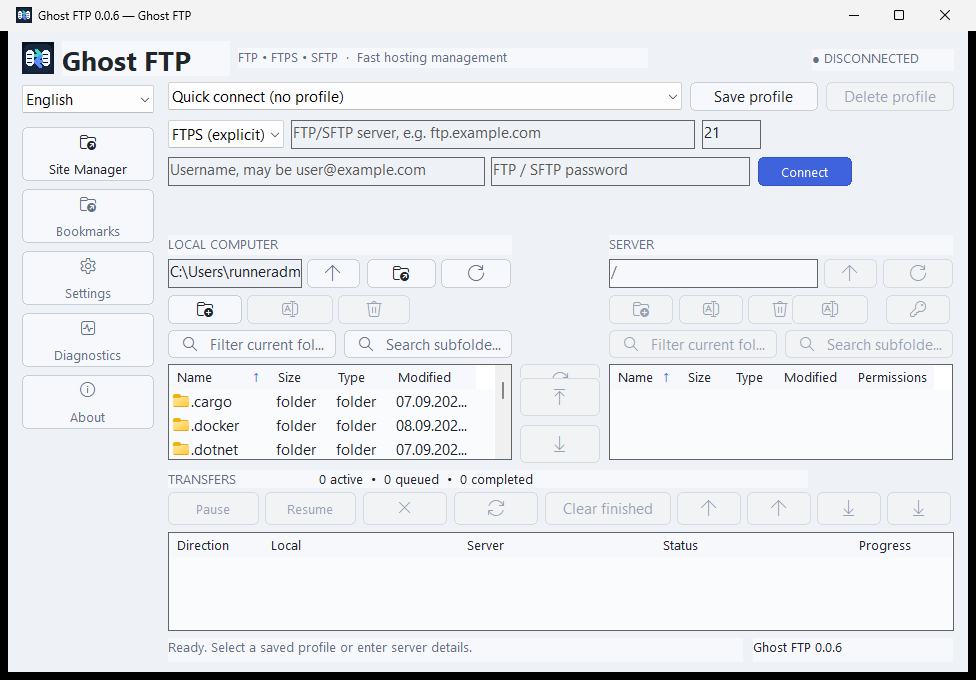
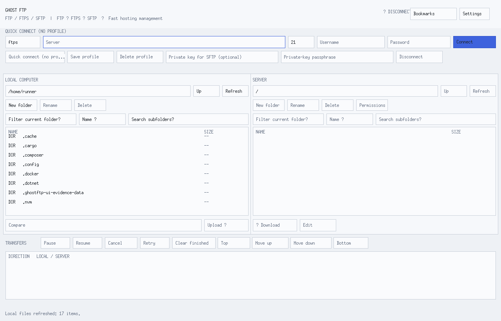
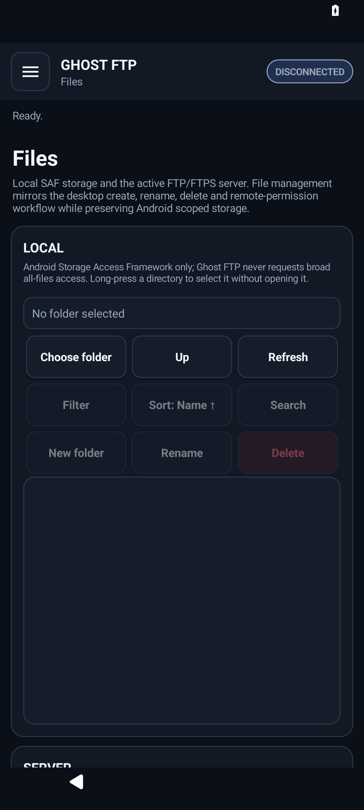

# Ghost FTP

<p align="center">
  
</p>

<h3 align="center">Your servers. Your files. Your control.</h3>

<p align="center">
A privacy-first FTP, FTPS and SFTP workspace for direct professional file transfer without telemetry, advertising, mandatory product accounts or a hidden storage cloud.
</p>

<p align="center">
  <a href="docs/INSTALLATION.md"><strong>Install</strong></a> ·
  <a href="docs/SECURITY.md"><strong>Security</strong></a> ·
  <a href="docs/PRIVACY.md"><strong>Privacy</strong></a> ·
  <a href="docs/README.md"><strong>Documentation</strong></a>
</p>

<p align="center">
  <strong>0.0.8 release candidate</strong> · Current channel · 24 desktop languages · no telemetry
</p>

---

## Built for direct, controlled file transfer

<table>
<tr>
<td width="33%" valign="top" align="center"><br><strong>Real transfer workspace</strong><br><sub>Local + remote panes, queue lifecycle, retry, cancellation, priority, Remote Edit and directory operations.</sub></td>
<td width="33%" valign="top" align="center"><br><strong>Fail-closed security</strong><br><sub>Strict desktop SFTP host-key trust, verified FTPS identity and protected publication signing.</sub></td>
<td width="33%" valign="top" align="center"><br><strong>Privacy by architecture</strong><br><sub>No telemetry, ads, behavioral analytics, hidden sync service or mandatory Ghost FTP account.</sub></td>
</tr>
<tr>
<td width="33%" valign="top" align="center"><br><strong>Native platform surfaces</strong><br><sub>Windows, Linux, Android and maintained macOS source with platform-specific lifecycle ownership.</sub></td>
<td width="33%" valign="top" align="center"><br><strong>Verified releases</strong><br><sub>Exact-head builds, checksums, Authenticode, protected Android signing and readback verification.</sub></td>
<td width="33%" valign="top" align="center"><br><strong>Auditable documentation</strong><br><sub>Security, privacy, packaging, platform parity, release verification and runtime evidence stay version-bound.</sub></td>
</tr>
</table>

### What 0.0.8 changes

Ghost FTP 0.0.8 consolidates the new master workspace across the maintained native applications: **Files, Connections, Transfer Queue and Settings**, with **Bookmarks, Connection info and About** as supporting surfaces. It also includes Dark/Light palette parity, tighter empty states, safer option defaults, Restore Defaults flows and refreshed runtime evidence.

---

## Product scope

Ghost FTP connects native applications directly to infrastructure selected by the user. The maintained repository product surfaces are Windows, Linux, Android, macOS source, and local browser helper packages.

The retired website and Web FTP implementation are intentionally not part of this repository or product runtime.

Ghost FTP contains no application telemetry, behavioral analytics, advertising, fingerprinting, hidden synchronization, mandatory Ghost FTP account, automatic crash-upload backend, or Ghost FTP storage cloud.

## Security model

- FTP is available as an intentional unencrypted compatibility protocol.
- Explicit FTPS validates certificate trust and server hostname identity.
- Desktop SFTP uses strict SSH host-key trust and pinning.
- Android exposes FTP and strict explicit FTPS; SFTP remains hidden until strict host-key verification is maintained on Android.
- Production publication fails closed when required signing identities are unavailable.
- Native transfer traffic goes to the server selected by the user.

## File and transfer operations

Ghost FTP provides real file-management and transfer operations rather than simulated controls:

- local and remote navigation
- filtering and search
- directory comparison
- bookmarks
- upload and download
- transfer queue lifecycle, retry, cancellation and priority
- Remote Edit
- create directory
- rename
- delete
- CHMOD where supported

## Supported product surfaces

| Platform | Status | Distribution / boundary |
| --- | --- | --- |
| **Windows** | Current release target | Universal Setup and Portable applications with x64, x86 and ARM64 payloads |
| **Linux** | Current release target | Debian, Ubuntu and Fedora Installer + Portable bundles |
| **Android** | Current release target | Production-signed APK with FTP and strict explicit FTPS |
| **macOS** | Maintained native source | Public package is withheld until Developer ID Application signing and Apple notarization are verified |
| **Browser helpers** | Current release target | Chrome, Edge, Firefox and Opera local helper packages |

Browser helpers have zero browser permissions and zero host permissions. Windows installed builds support a **sanitized browser-to-desktop handoff** through the registered `ghostftp:` protocol. Only protocol, host, optional port, optional username and remote path are handed to the desktop app; passwords, private-key passphrases, private keys, query data and fragments are excluded. The helper never performs FTP/FTPS/SFTP transport itself and never auto-connects.

---

## Runtime evidence

These repository-local screenshots document maintained Windows, Linux and Android application surfaces. They are exact-head runtime evidence, not generated product mockups.

### Windows



### Linux



### Android



See [Reference UI](docs/REFERENCE-UI.md) for the complete 15-image evidence contract.

---

## Ghost FTP 0.0.8

Current source version: **0.0.8**
Release channel: **Current**
Product status: **Current**
Last actually published GitHub Release: **0.0.7**
Next public release target: **ghostftp-v0.0.8**
Prerelease: **false**

The 0.0.8 publication contract contains **13 platform artifacts / 16 public files**.

### Windows

```text
Ghost-FTP-0.0.8-Setup.exe
Ghost-FTP-0.0.8-Portable.exe
```

Both public Windows executables carry x64, x86 and ARM64 payloads internally.

### Linux

```text
Ghost-FTP-0.0.8-Linux-Debian-Installer.run
Ghost-FTP-0.0.8-Linux-Debian-Portable.tar.gz
Ghost-FTP-0.0.8-Linux-Ubuntu-Installer.run
Ghost-FTP-0.0.8-Linux-Ubuntu-Portable.tar.gz
Ghost-FTP-0.0.8-Linux-Fedora-Installer.run
Ghost-FTP-0.0.8-Linux-Fedora-Portable.tar.gz
```

Each distro bundle carries amd64, arm64 and i386 payloads and selects the local architecture at runtime.

### Android

```text
Ghost-FTP-0.0.8-Android.apk
```

Publication requires `apksigner` verification and an exact protected `GHOSTFTP_ANDROID_CERT_SHA256` signer fingerprint match.

### Browser helpers

```text
Ghost-FTP-0.0.8-Chrome-Extension.zip
Ghost-FTP-0.0.8-Edge-Extension.zip
Ghost-FTP-0.0.8-Firefox-Extension.zip
Ghost-FTP-0.0.8-Opera-Extension.zip
```

The four packages use one shared local runtime with browser-specific manifests. On supported Windows installs, the explicit **Open in Ghost FTP** action uses the sanitized `ghostftp://connect` handoff described above; credentials never enter that launch URL.

---

## Release integrity

Ghost FTP publication is bound to source identity: the binary being published must correspond to the **exact final head SHA** that passed verification.

Version 0.0.8 is published only after:

- the exact final head SHA is merged to `main`;
- the complete post-merge gate succeeds;
- trusted Windows Authenticode signing succeeds;
- the protected Android signing identity matches `GHOSTFTP_ANDROID_CERT_SHA256`;
- release assets are published successfully;
- published assets pass readback verification without drift.

Canonical release identity:

```text
VERSION=0.0.8
TAG=ghostftp-v0.0.8
CHANNEL=Current
PRERELEASE=false
PUBLIC_PLATFORM_ARTIFACTS=13
PUBLIC_RELEASE_FILES=16
WINDOWS_NATIVE_PAYLOADS=x64,x86,arm64
WINDOWS_ARM64_RUNTIME_EVIDENCE=not-native-ci
```

Release metadata files:

```text
BUILD-METADATA.txt
RELEASE-NOTES.txt
SHA256.txt
```

The verified release directory is additionally represented as `ghcr.io/bren-wp/ghost-ftp:0.0.8`. This OCI object is a distribution bundle, not a runtime product backend.

---

## Privacy

Ghost FTP does not require a Ghost FTP product account and does not contain application telemetry, behavioral analytics, advertising, fingerprinting, hidden synchronization or automatic crash uploading.

Saved credentials are opt-in and platform-local. See [Privacy](docs/PRIVACY.md) and [Security](docs/SECURITY.md) for platform-specific boundaries.

---

## Quality gates

Release-candidate checks include Go formatting/tests/vet, repository/security/privacy/localization/documentation audits, Python regression tests, Windows universal packaging, Linux bundle generation and lifecycle tests, Android build/lint/signing checks, deterministic browser packages, macOS source builds, CodeQL and Govulncheck.

A pull request is merge-ready only when workflows for its exact final head SHA reach terminal success.

---

## Localization

Ghost FTP maintains 24 selectable desktop languages with English as the canonical default and fallback: English, Croatian, German, French, Spanish, Turkish, Greek, Portuguese, Chinese, Russian, Hindi, Japanese, Italian, Polish, Dutch, Czech, Ukrainian, Swedish, Romanian, Hungarian, Danish, Finnish, Norwegian and Korean.

---

## Commercial proprietary software

Ghost FTP is proprietary commercial software. It is not open-source software and is not distributed under an OSI-approved license.

Source visibility does not grant a general right to modify, redistribute, sublicense, rebrand, white-label or incorporate Ghost FTP into another product.

Ghost FTP and its source code, binaries, user interfaces, documentation, branding, icons and release engineering are copyrighted works of **Brendigo LTD**.

Copyright © 2026 Brendigo LTD. All rights reserved.

See [`LICENSE`](LICENSE) and [`docs/THIRD-PARTY-NOTICES.md`](docs/THIRD-PARTY-NOTICES.md).

---

## Documentation

- [Documentation overview](docs/README.md)
- [Installation](docs/INSTALLATION.md)
- [Architecture](docs/ARCHITECTURE.md)
- [Platform parity](docs/PLATFORM-PARITY.md)
- [Security](docs/SECURITY.md)
- [Privacy](docs/PRIVACY.md)
- [Signing](docs/SIGNING.md)
- [Release verification](docs/RELEASE-VERIFICATION.md)
- [Testing](docs/TESTING.md)
- [Reference UI](docs/REFERENCE-UI.md)
- [Roadmap](docs/ROADMAP.md)

<p align="center">
<strong>Ghost FTP</strong><br>
Direct file transfer. Clear security boundaries. No cloud middleman.
</p>
