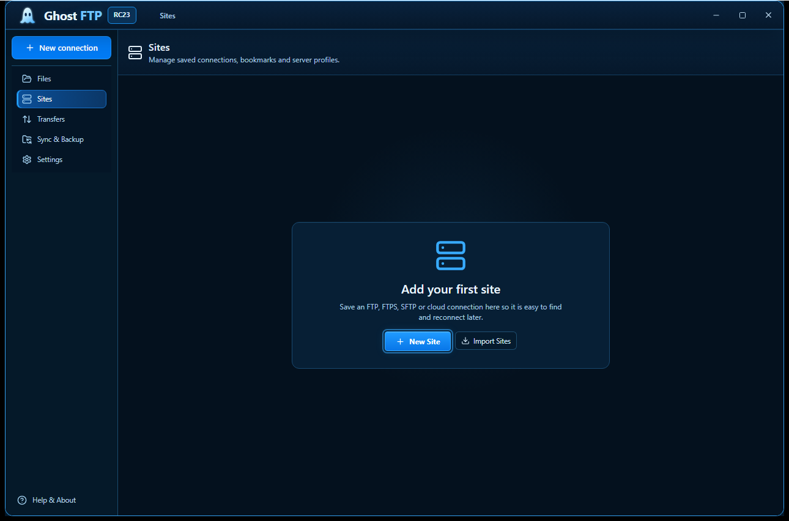
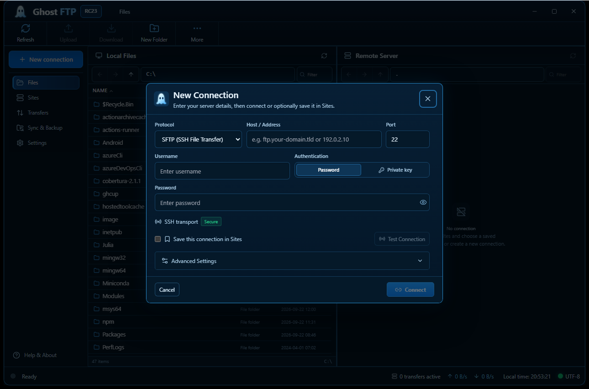
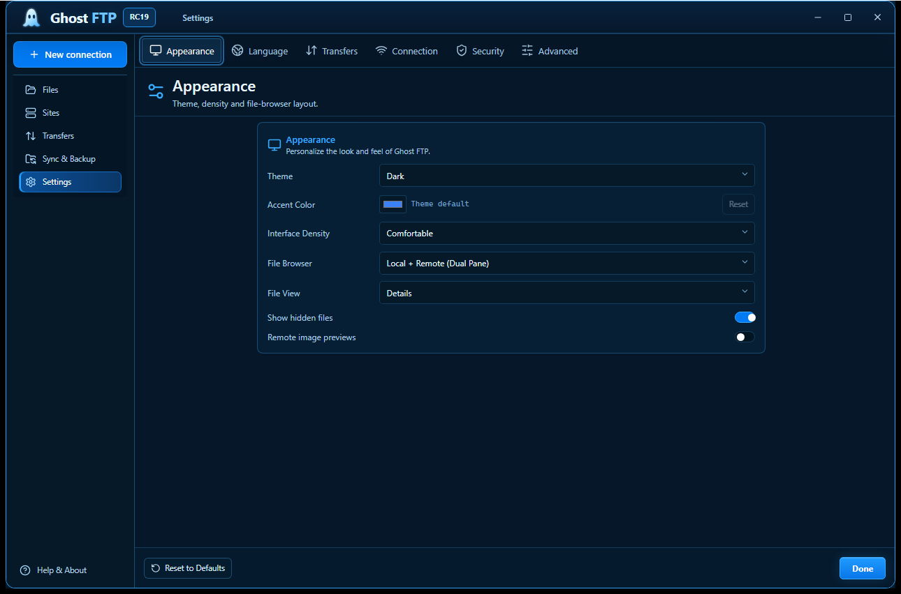
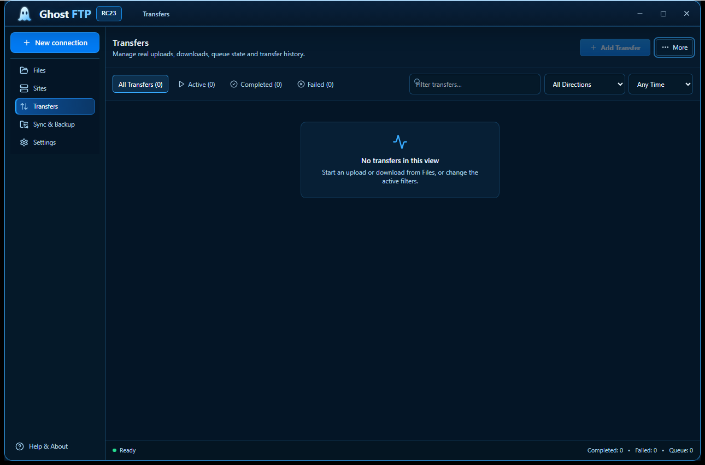
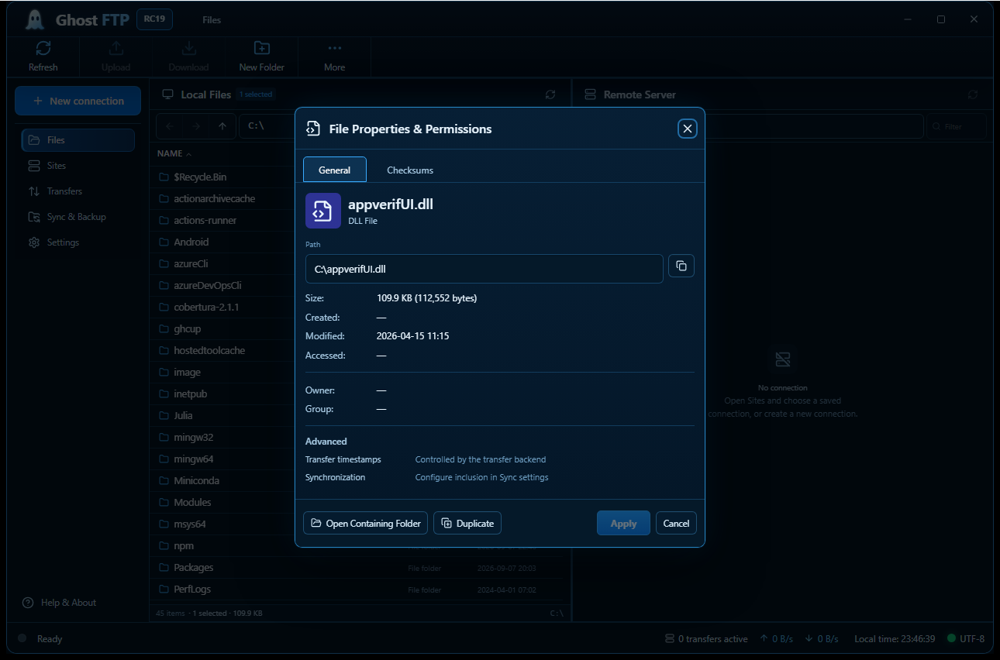
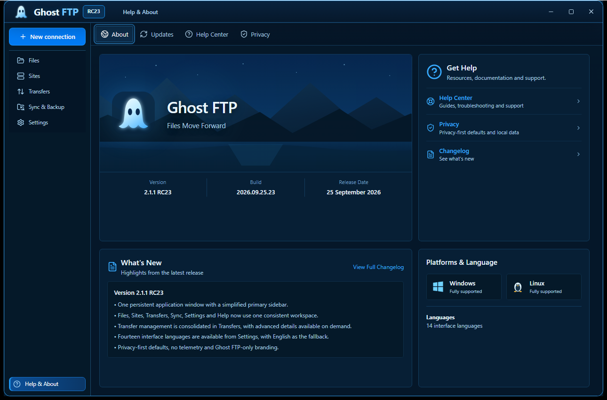

<div align="center">


### More Than Transfer. Total Control.

**A modern, privacy-first FTP / FTPS / SFTP client for Windows and Linux.**

[Website](https://ghostftp.com/) ·
[Releases](https://github.com/bren-wp/Ghost-FTP/releases) ·
[Documentation](docs/README.md) ·
[Security](SECURITY.md) ·
[Changelog](CHANGELOG.md)

</div>

<p align="center">
  <a href="docs/assets/screenshots/ghostftp-native-files.png"></a>
</p>

<p align="center"><sub><strong>Actual native application screenshot.</strong> Captured automatically from the Windows RC19 executable at the canonical 1290×852 QA viewport — not a mockup, design render or screenshot-backed runtime.</sub></p>

## Modern file transfer without the legacy workflow

Ghost FTP brings secure server connections, dual-pane file management, saved sites, transfer queues, synchronization, checksums, permissions, terminal tools and practical server workflows into one consistent desktop product.

It is built for developers, agencies, hosting teams and power users who want **fast transfers, clear control and a modern Windows/Linux interface** instead of a collection of dated dialogs.

<table>
<tr><td width="52"></td><td><strong>Secure connections</strong><br>FTP, FTPS and SFTP with native TLS/SSH verification paths and protected credential storage where supported.</td></tr>
<tr><td></td><td><strong>Fast transfers</strong><br>Concurrent queues, pause/resume, retries, conflict handling and bandwidth controls.</td></tr>
<tr><td></td><td><strong>One workspace</strong><br>Local and remote browsing, Site Manager, permissions, checksums, sync, search and terminal tools.</td></tr>
<tr><td></td><td><strong>Privacy first</strong><br>No required analytics or telemetry. Sensitive profile secrets stay outside ordinary profile JSON.</td></tr>
<tr><td></td><td><strong>English-first, multilingual</strong><br>English is primary with 13 additional selectable languages.</td></tr>
<tr><td></td><td><strong>Windows + Linux</strong><br>Windows portable EXE and Setup plus Linux native binary, AppImage, DEB and RPM packages.</td></tr>
</table>

## Actual native application — 1:1 screenshots

The screenshots below are generated by the Windows native QA workflow from the same Ghost FTP executable that is validated for the release candidate. They are committed to the repository only after the real app renders the required view successfully.

### Files

<p align="center">
  <a href="docs/assets/screenshots/ghostftp-native-files.png"></a>
</p>

### Sites and New Connection

<p align="center">
  <a href="docs/assets/screenshots/ghostftp-native-sites.png"></a>
  <a href="docs/assets/screenshots/ghostftp-native-new-connection.png"></a>
</p>

### Settings and Transfers

<p align="center">
  <a href="docs/assets/screenshots/ghostftp-native-settings.png"></a>
  <a href="docs/assets/screenshots/ghostftp-native-transfers.png"></a>
</p>

### File Properties and Help & About

<p align="center">
  <a href="docs/assets/screenshots/ghostftp-native-file-properties.png"></a>
  <a href="docs/assets/screenshots/ghostftp-native-about.png"></a>
</p>

These repository screenshots are **1:1 captures of the running native Windows app at 1290×852**. Click any image to open the original full-resolution PNG. The release QA additionally checks compact and near-minimum layouts, but README imagery intentionally uses the canonical native viewport so controls, spacing and window chrome match the actual application.

## Core workflow

**Connect.** Use **New connection** for a temporary connection or save a reusable profile in Sites.

**Browse.** Work with local and remote files side by side.

**Transfer.** Upload, download, pause, resume, retry, cancel and inspect queue state without leaving the workspace.

**Control.** Use permissions, checksums, sync, terminal, search, duplicate detection and diagnostics from the same product.

## Implemented in current RC19 source

- FTP, explicit FTPS and SFTP temporary connections and saved profiles with real protocol E2E acceptance.
- Site Manager with folders, favorites, tags, bookmarks and recent-server metadata.
- Dual-pane file browsing and normal file operations.
- Upload/download queues with pause, resume, retry, cancel and bandwidth controls.
- SHA-256 and supported permission/chmod workflows.
- Folder sync, directory comparison, duplicate discovery and disk analysis.
- Integrated terminal, command palette, snippets and keyboard shortcuts; terminal suggestion history is session-only and sensitive-looking commands are excluded.
- Protected credential handling where supported by the operating system.
- Native Windows and Linux packaging.
- Branded preview/stable update-channel structure.
- English-first interface with 13 additional selectable languages.

See [Features](docs/product/FEATURES.md) and [Project status](docs/product/STATUS_AND_NEXT.md).

## Downloads and release artifacts

The current source line is **Ghost FTP 2.1.1 RC19**. GitHub Releases is the authoritative source for the latest published candidate and its SHA-256 checksums. RC19 publication is allowed only from the exact source commit that passes quality, real FTP/explicit-FTPS/SFTP E2E, Windows/Linux native builds and Windows native visual QA.

**Windows x64**
- `GhostFTP-Windows-x64-Portable-v2.1.1-RC19.exe`
- `GhostFTP-Windows-x64-Setup-v2.1.1-RC19.exe`
- `GhostFTP-Windows-x64-v2.1.1-RC19.zip`
- `GhostFTP-Windows-x64-v2.1.1-RC19-Native-QA.zip`

**Linux x86-64**
- `GhostFTP-Linux-x86_64-v2.1.1-RC19`
- `GhostFTP-Linux-x86_64-v2.1.1-RC19.AppImage`
- `GhostFTP-Linux-amd64-v2.1.1-RC19.deb`
- `GhostFTP-Linux-x86_64-v2.1.1-RC19.rpm`
- `GhostFTP-Linux-x86_64-v2.1.1-RC19.tar.gz`

**Source and verification**
- `GhostFTP-v2.1.1-RC19-Source.zip`
- `GhostFTP-v2.1.1-RC19-Desktop-Source.zip`
- `GhostFTP-v2.1.1-RC19-Website.zip`
- `GhostFTP-v2.1.1-RC19-Updates.zip`
- `GhostFTP-v2.1.1-RC19-Documentation.zip`
- `GhostFTP-v2.1.1-RC19-SHA256SUMS.txt`

The Windows native QA bundle contains the seven critical product surfaces at canonical, compact and near-minimum viewports. Older release candidates remain immutable in GitHub Releases.

## Repository layout

```text
Ghost-FTP/
├── ghostftp-desktop/        Production Windows/Linux desktop application
├── website/                 ghostftp.com source
├── updates/                 Update channels, manifest schema and tools
├── tools/
│   ├── ghostftp-runtime/    Developer compatibility tooling
│   └── ghostftp-installer/  Developer installer-support tooling
├── docs/
│   ├── assets/              Product screenshots and brand media
│   ├── guides/              Installation, updates, support and uninstall
│   ├── legal/               Privacy and notices
│   ├── product/             Features, status and UI/UX
│   ├── development/         Source-build and contributor workflow
│   ├── release/             Release process and gates
│   ├── qa/                  Acceptance evidence and test records
│   └── releases/            Versioned release notes and checksums
├── .github/workflows/       Quality, native build and release automation
├── README.md
├── CHANGELOG.md
├── SECURITY.md
├── LICENSE.txt
└── EULA.txt
```

Use **Ghost FTP** in user-facing copy and **GhostFTP** in executable/archive names. Framework-specific names are kept only where the build ecosystem requires them internally.

## Commercial product documentation

Public documentation is intentionally product-focused. It documents supported features, install/update behavior, privacy, release status and recommended future work without exposing unnecessary internal implementation detail.

- [Documentation](docs/README.md)
- [Features](docs/product/FEATURES.md)
- [Status & recommended next work](docs/product/STATUS_AND_NEXT.md)
- [Roadmap](docs/ROADMAP.md)
- [Building from source](docs/development/BUILDING.md)
- [Release process](docs/release/PROCESS.md)
- [UI/UX principles](docs/product/UI_UX.md)
- [Install](docs/guides/INSTALLATION.md)
- [Updates](docs/guides/UPDATES.md)
- [Support](docs/guides/SUPPORT.md)
- [Privacy](docs/legal/PRIVACY.md)

<div align="center">

**Ghost FTP**  
*More Than Transfer. Total Control.*  
**Simple. Secure. Powerful.**

Publisher: **Brendigo LTD / Brendigo, obrt za programiranje**  
Official website: **https://ghostftp.com/**

</div>

Copyright © 2026 Brendigo LTD and Brendigo, obrt za programiranje. All rights reserved.
