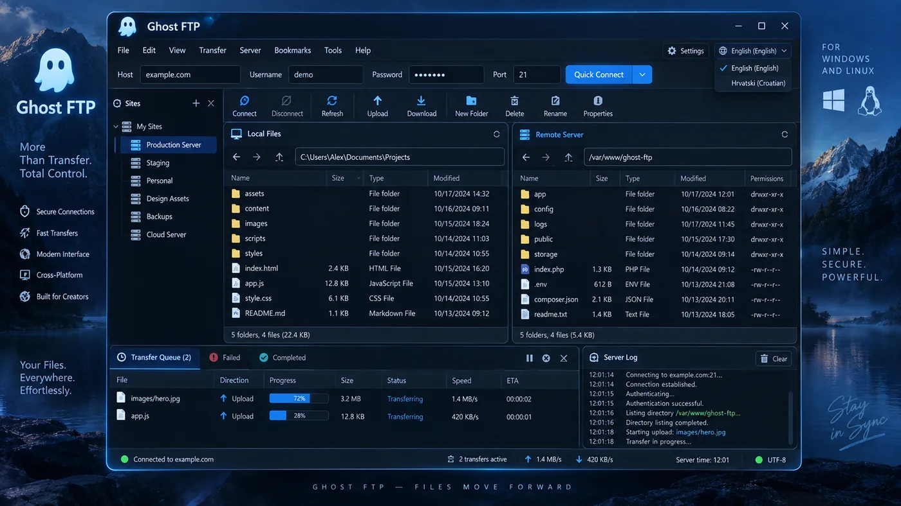
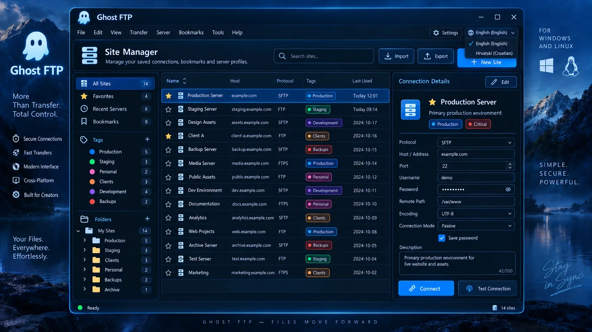
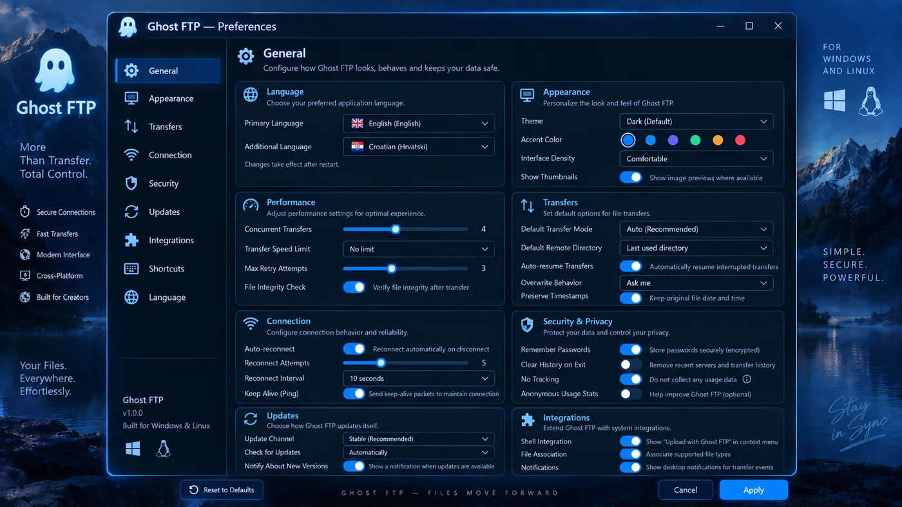
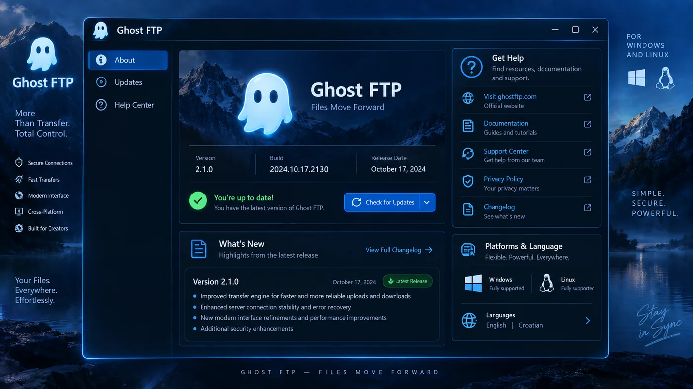

<div align="center">


### More Than Transfer. Total Control.

**A modern, privacy-first FTP / FTPS / SFTP client for Windows and Linux.**

[Website](https://ghostftp.com/) ·
[Releases](https://github.com/bren-wp/Ghost-FTP-Premium/releases) ·
[Documentation](docs/README.md) ·
[Security](SECURITY.md) ·
[Changelog](CHANGELOG.md)

</div>

<p align="center">
  
</p>

## Modern file transfer without the legacy workflow

Ghost FTP brings secure server connections, dual-pane file management, saved sites, transfer queues, synchronization, checksums, permissions, terminal tools and practical server workflows into one consistent desktop product.

It is built for developers, agencies, hosting teams and power users who want **fast transfers, clear control and a modern Windows/Linux interface** instead of a collection of dated dialogs.

<table>
<tr><td width="52"></td><td><strong>Secure connections</strong><br>FTP, FTPS and SFTP with native TLS/SSH verification paths and protected credential storage where supported.</td></tr>
<tr><td></td><td><strong>Fast transfers</strong><br>Concurrent queues, pause/resume, retries, conflict handling and bandwidth controls.</td></tr>
<tr><td></td><td><strong>One workspace</strong><br>Local and remote browsing, Site Manager, permissions, checksums, sync, search and terminal tools.</td></tr>
<tr><td></td><td><strong>Privacy first</strong><br>No required analytics or telemetry. Sensitive profile secrets stay outside ordinary profile JSON.</td></tr>
<tr><td></td><td><strong>English-first, multilingual</strong><br>English is primary with 13 additional selectable languages.</td></tr>
<tr><td></td><td><strong>Windows + Linux</strong><br>Windows portable EXE and Setup plus Linux native binary, AppImage, DEB and RPM packages.</td></tr>
</table>

## One Ghost FTP visual system

The Main File Manager, Site Manager, New Connection, Preferences, Transfer Center, File Properties and About surfaces share the same deep-navy/electric-blue visual language, spacing, controls and window chrome.

<p align="center">
  
  
</p>

<p align="center">
  
  
</p>

<p align="center">
  
  
</p>

The canonical desktop reference is **1290×852**. Smaller windows adapt through compact spacing, narrower navigation, contained scrolling and viewport-safe dialogs. Reference media is used for documentation and acceptance only; the running application uses real Ghost FTP components and controls.

## Core workflow

**Connect.** Use Quick Connect for a temporary session or save reusable profiles in Site Manager.

**Browse.** Work with local and remote files side by side.

**Transfer.** Upload, download, pause, resume, retry, cancel and inspect queue state without leaving the workspace.

**Control.** Use permissions, checksums, sync, terminal, search, duplicate detection and diagnostics from the same product.

## Implemented in RC10

- FTP, FTPS and SFTP Quick Connect and saved profiles.
- Site Manager with folders, favorites, tags, bookmarks and recent-server metadata.
- Dual-pane file browsing and normal file operations.
- Upload/download queues with pause, resume, retry, cancel and bandwidth controls.
- SHA-256 and supported permission/chmod workflows.
- Folder sync, directory comparison, duplicate discovery and disk analysis.
- Integrated terminal, command palette, snippets and keyboard shortcuts.
- Protected credential handling where supported by the operating system.
- Native Windows and Linux packaging.
- Branded preview/stable update-channel structure.
- English-first interface with 13 additional selectable languages.

See [Features](docs/product/FEATURES.md) and [Project status](docs/product/STATUS_AND_NEXT.md).

## Downloads — Ghost FTP 2.1.1 RC10

Published versions are kept available in GitHub Releases when newer versions are added.

**Windows x64**
- `GhostFTP-Windows-x64-Portable-v2.1.1-RC10.exe`
- `GhostFTP-Windows-x64-Setup-v2.1.1-RC10.exe`
- `GhostFTP-Windows-x64-v2.1.1-RC10.zip`
- `GhostFTP-Windows-x64-v2.1.1-RC10-Native-Window.png` (CI native-window QA evidence)

**Linux x86-64**
- `GhostFTP-Linux-x86_64-v2.1.1-RC10`
- `GhostFTP-Linux-x86_64-v2.1.1-RC10.AppImage`
- `GhostFTP-Linux-amd64-v2.1.1-RC10.deb`
- `GhostFTP-Linux-x86_64-v2.1.1-RC10.rpm`
- `GhostFTP-Linux-x86_64-v2.1.1-RC10.tar.gz`

**Source**
- `GhostFTP-v2.1.1-RC10-Source.zip`
- `GhostFTP-v2.1.1-RC10-Desktop-Source.zip`
- `GhostFTP-v2.1.1-RC10-Website.zip`
- `GhostFTP-v2.1.1-RC10-Updates.zip`
- `GhostFTP-v2.1.1-RC10-Documentation.zip`
- `GhostFTP-v2.1.1-RC10-SHA256SUMS.txt`

## Repository layout

```text
Ghost-FTP-Premium/
├── ghostftp-desktop/        Production Windows/Linux desktop application
├── website/                 ghostftp.com source
├── updates/                 Update channels, manifest schema and tools
├── tools/
│   ├── ghostftp-runtime/    Developer compatibility tooling
│   └── ghostftp-installer/  Developer installer-support tooling
├── docs/
│   ├── assets/              Product screenshots and brand media
│   ├── guides/              Installation, updates, support and uninstall
│   ├── legal/               Privacy and notices
│   ├── product/             Features, status and UI/UX
│   ├── development/         Source-build and contributor workflow
│   ├── release/             Release process and gates
│   ├── qa/                  Acceptance evidence and test records
│   └── releases/            Versioned release notes and checksums
├── .github/workflows/       Quality, native build and release automation
├── README.md
├── CHANGELOG.md
├── SECURITY.md
├── LICENSE.txt
└── EULA.txt
```

Use **Ghost FTP** in user-facing copy and **GhostFTP** in executable/archive names. Framework-specific names are kept only where the build ecosystem requires them internally.

## Commercial product documentation

Public documentation is intentionally product-focused. It documents supported features, install/update behavior, privacy, release status and recommended future work without exposing unnecessary internal implementation detail.

- [Documentation](docs/README.md)
- [Features](docs/product/FEATURES.md)
- [Status & recommended next work](docs/product/STATUS_AND_NEXT.md)
- [Roadmap](docs/ROADMAP.md)
- [Building from source](docs/development/BUILDING.md)
- [Release process](docs/release/PROCESS.md)
- [UI/UX principles](docs/product/UI_UX.md)
- [Install](docs/guides/INSTALLATION.md)
- [Updates](docs/guides/UPDATES.md)
- [Support](docs/guides/SUPPORT.md)
- [Privacy](docs/legal/PRIVACY.md)

<p align="center">
  
</p>

<div align="center">

**Ghost FTP**  
*More Than Transfer. Total Control.*  
**Simple. Secure. Powerful.**

Publisher: **Brendigo LTD / Brendigo, obrt za programiranje**  
Official website: **https://ghostftp.com/**

</div>

Copyright © 2026 Brendigo LTD and Brendigo, obrt za programiranje. All rights reserved.
