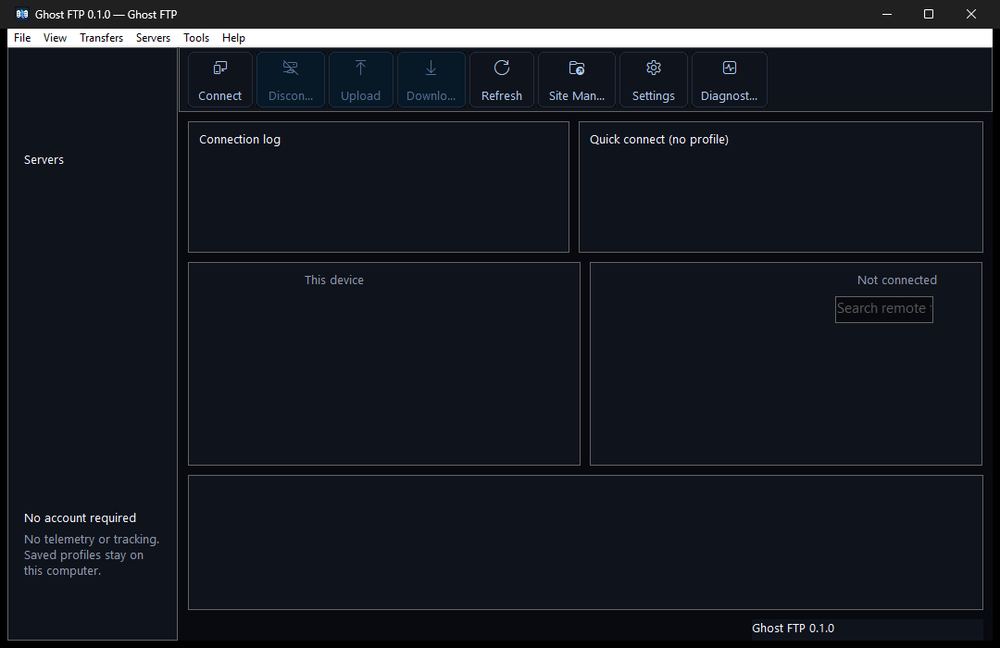
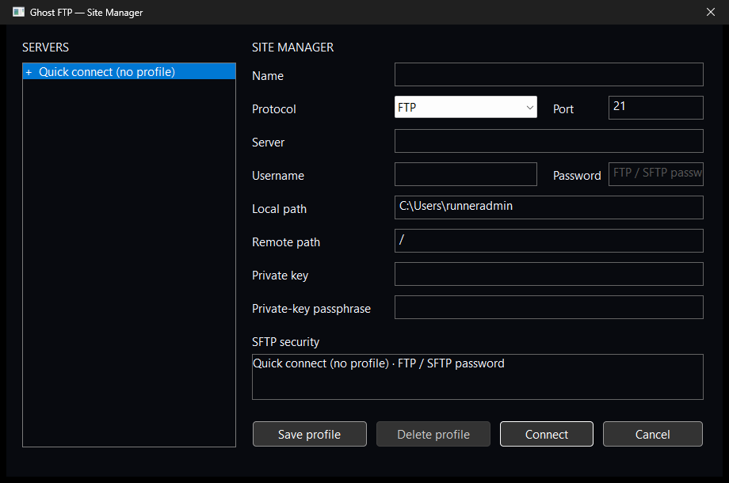

# Ghost FTP

**Ghost FTP** is a privacy-first FTP, FTPS and SFTP desktop client focused on dependable transfers, conservative security defaults and a clean professional workflow.

Current Ghost FTP version: **0.1.1**

Development status: **Beta**

The active development line starts at **0.1.0 Beta** and advances through `0.x.y` while the product is being completed and stabilized. The first release that may be presented as fully stable is **1.0.0**. Windows Setup and Windows Portable always carry the same canonical version.

The maintained desktop application targets are:

- **Windows** — native Win32 desktop UI, x64 and x86, with Setup and Portable packages.
- **Linux** — the same shared transfer/security engine, packaged for amd64, arm64 and i386, with a native dependency-free X11/XWayland GUI and hardened terminal fallback.

Android, iOS and macOS application targets are not part of the active application source/build matrix. Their historical commits, tags and releases remain available as immutable repository provenance and are not deleted or rewritten.

The repository also contains the existing **Ghost FTP Web companion** source. It is maintained separately from the Windows/Linux desktop release contract and has independent deployment concerns.

## Product principles

Ghost FTP is built around a small set of non-negotiable rules:

- no application telemetry, analytics, advertising or crash-reporting SDKs;
- no fixed analytics/update endpoint in the desktop runtime;
- no generic localhost API or browser IPC between the UI and transfer engine;
- fail-closed connection, path, credential and host-key validation;
- explicit SFTP host-key trust;
- bounded transfer retries and timeouts;
- atomic state writes and conservative overwrite recovery;
- reproducible Windows/Linux release artifacts with SHA-256 verification;
- English as the canonical/default language with 24 maintained languages;
- no third-party Go modules in the desktop/core module.

## Protocols

### SFTP

SFTP uses OpenSSH semantics and supports:

- password authentication;
- private-key authentication;
- private keys protected with a passphrase;
- explicit host-key fingerprint trust;
- saved fingerprint binding to the expected endpoint;
- proxy/jump/agent forwarding disabled by the application-created SSH configuration;
- protected runtime credential handoff without writing an AskPass secret file.

### FTPS

Explicit FTPS and implicit FTPS are supported with certificate validation enabled. Ghost FTP does not silently disable TLS certificate revocation checks.

### FTP

Plain FTP is supported for compatibility with servers that require it, but it is unencrypted and should only be used when the server cannot provide FTPS or SFTP.

Implicit FTPS uses the dedicated `ftpsi` transport mode and the conventional port 990 while retaining certificate validation.

## Windows experience

The Windows edition is the reference graphical experience. It includes:

- native near-black Ghost FTP interface aligned with the maintained Web brand tokens;
- persistent one-click **Sites** access and a dedicated Site Manager;
- saved connection profiles and quick connections;
- local and remote file panels with balanced dual-pane layout;
- high-DPI-aware layout and typography;
- protocol/host/port/user/password controls;
- SFTP private-key and passphrase controls;
- upload and download actions;
- remote create, rename, delete and permissions operations;
- a remote **Permissions** column populated only from validated server-provided UNIX mode metadata (`LIST`/SFTP symbolic mode or MLSD `unix.mode`); unsupported listings remain blank rather than displaying invented permissions;
- local create, rename and delete operations;
- transfer queue with pause, resume, cancel, retry and clear-finished actions;
- conflict policies: `skip`, `replace`, and `replace_backup`;
- automatic retry, retry-delay, parallelism and connection-timeout settings;
- live language switching;
- localized Windows Setup flow;
- x64 and x86 Setup/Portable packages;
- the same application UI and transfer/security engine in both Setup-installed and Portable editions.

The current visual work keeps Ghost FTP native and recognizably its own product while adopting the information density and workflow clarity expected from a professional desktop FTP client. The UI does not add decorative controls for features that the backend does not actually implement.

The maintained Windows layout contract is documented in [docs/REFERENCE-UI.md](docs/REFERENCE-UI.md).

## Authentic Windows UI

These images are **not mockups**. GitHub Actions builds the production Windows x64 Portable executable, launches that real executable on a Windows runner, captures its native Win32 windows with `PrintWindow(PW_RENDERFULLCONTENT)`, validates the PNG signature/dimensions/size, records SHA-256 evidence and only then compares/persists the images in this repository.

### Main workspace



### Site Manager



The current reference images are reproducibly verified byte-identical to production Portable runtime captures:

- main workspace: `1080x700`, SHA-256 recorded by the current authentic capture workflow;
- Site Manager: `920x610`, SHA-256 recorded by the current authentic capture workflow.

The capture workflow deliberately uses no real FTP credentials, customer data or production server. See `.github/workflows/ui-screenshots.yml` and `scripts/capture_windows_screenshots.ps1` for the reproducible capture contract.

## Linux experience

Linux uses the same `internal/api`, remote/session, transfer, settings, profile, localization and security layers as Windows.

The maintained Linux frontend includes:

- FTP/FTPS password authentication;
- SFTP password authentication when no private key is supplied;
- SFTP private-key authentication with an optional passphrase;
- explicit host-key trust through the shared engine;
- remote list, navigation, create, rename, delete and chmod operations;
- upload/download jobs through the shared transfer scheduler;
- transfer queue listing, pause, resume, cancel, retry and clear-finished operations;
- shared validated settings for parallelism, conflict policy, retries, retry delay, connection timeout and delete confirmation;
- saved-profile inspection without exposing saved secrets;
- runtime language selection using the canonical localization registry.

Windows and Linux now both provide graphical desktop frontends over the same functional core. Windows uses native Win32; Linux uses a dependency-free raw X11/XWayland-compatible frontend and retains the hardened terminal interface for headless or explicit fallback use. Their native control implementations are not claimed to be pixel-identical, but they share the same Ghost FTP palette, action model and security boundaries without adding a third-party GUI framework.

## Languages

Ghost FTP is English-first and currently exposes **24 languages**:

1. English (`en`) — canonical source and default fallback
2. Croatian (`hr`)
3. German (`de`)
4. French (`fr`)
5. Spanish (`es`)
6. Turkish (`tr`)
7. Greek (`el`)
8. Portuguese (`pt`)
9. Chinese, Simplified (`zh`)
10. Russian (`ru`)
11. Hindi (`hi`)
12. Japanese (`ja`)
13. Italian (`it`)
14. Polish (`pl`)
15. Dutch (`nl`)
16. Czech (`cs`)
17. Ukrainian (`uk`)
18. Swedish (`sv`)
19. Romanian (`ro`)
20. Hungarian (`hu`)
21. Danish (`da`)
22. Finnish (`fi`)
23. Norwegian (`no`)
24. Korean (`ko`)

Regional aliases such as Norwegian `nb`/`nn` and Simplified Chinese aliases normalize to the canonical registry. Missing or invalid locale state falls back safely to English.

CI validates the language registry, catalog parity, format verbs, translation coverage, Windows live localization, Windows Setup localization and Linux runtime localization.

## Transfer options

The canonical settings model contains:

| Option | Supported range / values | Safe default |
| --- | --- | --- |
| Parallel transfers | 1–8 | 2 |
| Conflict policy | `skip`, `replace`, `replace_backup` | `replace_backup` |
| Automatic retries | 0–3 | 0 |
| Retry delay | 1–30 seconds | 3 seconds |
| Connection timeout | 5–60 seconds | 15 seconds |
| Confirm delete | on/off | on |
| Language | 24 registered locales | English |

`replace_backup` is the conservative overwrite default. Persisted unknown conflict states migrate back to this policy rather than silently weakening recovery behavior.

## Privacy

Ghost FTP does not contain application analytics, advertising, tracking pixels, crash-reporting SDKs or an application-controlled telemetry service.

The desktop runtime deliberately blocks fixed HTTP(S) URLs in `cmd/` and `internal/`, and CI runs a privacy audit that rejects known telemetry/vendor markers and unexpected network-client imports.

The application communicates with the server address entered by the user for FTP/FTPS/SFTP file transfer. Build and release workflows use GitHub infrastructure only for source/build/release automation; that is separate from the installed application's runtime behavior.

See [docs/PRIVACY.md](docs/PRIVACY.md).

## Security model

Important enforced boundaries include:

- credentials never pass through a generic JSON dispatcher;
- Windows saved profile secrets use DPAPI-backed protection;
- non-Windows runtime secrets use short-lived protected in-process storage;
- SFTP AskPass credentials are not written to disk;
- SFTP host keys are explicitly trusted and endpoint-bound;
- proxy, jump-host, agent-forwarding and ambient SSH state are disabled for application sessions;
- FTP/FTPS proxy environment variables are sanitized;
- download staging paths reject symlink/reparse-point substitution;
- local delete/rename paths use no-follow and no-replace protections;
- filesystem-root recursive deletion is blocked;
- remote session shutdown is bounded and race-protected;
- profile credentials cannot silently cross account/endpoint/private-key identity boundaries;
- settings/profile state uses guarded atomic writes.

See [docs/SECURITY.md](docs/SECURITY.md).

## Dependencies

The desktop/core Go module intentionally has **zero external Go modules**: no `require`, `replace`, vendored module tree or `go.sum` dependency graph is accepted by CI.

That does not mean the current transport implementation has zero operating-system prerequisites. The desktop transport layer currently uses OS-provided tools:

- FTP/FTPS: `curl`
- SFTP: OpenSSH `ssh` and `sftp`

Linux packages declare the required runtime packages. Windows relies on suitable system-provided components. Ghost FTP does not bundle those projects as hidden third-party Go libraries.

See [docs/DEPENDENCIES.md](docs/DEPENDENCIES.md).

## Build from source

Required desktop toolchain:

- Go **1.27.1**
- Python 3 for repository/release verification scripts

Before a production build, disable Go telemetry:

```text
go telemetry off
```

### Windows

Use:

```text
.\BUILD-WINDOWS.ps1
```

The canonical build creates Setup and Portable x64/x86 artifacts in `dist/` and injects the root `VERSION` into every binary/package. Setup and Portable never advance independently.

For the current baseline the primary Windows names are:

```text
Ghost-FTP-0.1.1-Setup-x64.exe
Ghost-FTP-0.1.1-Setup-x86.exe
Ghost-FTP-0.1.1-Portable-x64.exe
Ghost-FTP-0.1.1-Portable-x86.exe
```

### Linux

Use:

```text
bash linux/BUILD.sh
```

The canonical Linux build creates DEB packages for amd64, arm64 and i386.

See [docs/INSTALLATION.md](docs/INSTALLATION.md), [docs/TESTING.md](docs/TESTING.md) and [docs/VERSIONING.md](docs/VERSIONING.md).

## Versioning and stability

The active version baseline is intentionally reset to the pre-stable line:

```text
0.1.0 Beta → 0.x.y Beta → 1.0.0 stable
```

A `0.x.y` build is a Beta build. It may include substantial completed functionality, but it remains pre-1.0 until the complete product-quality gate is satisfied.

The first stable public milestone is **1.0.0**. That version is reserved for the point where the maintained Windows/Linux application, packaging, security, localization, documentation and release verification are considered complete and stable.

Historical repository tags/releases remain untouched and are documented separately. They do not force the active development baseline to skip directly to a stable version.

See [docs/VERSIONING.md](docs/VERSIONING.md) for the complete policy.

## Releases

Release tags use:

```text
ghostftp-vX.Y.Z
```

Every `0.x.y` GitHub Release is treated as a **prerelease/Beta**. A release at `1.0.0` or later may be stable once all release gates pass.

The current Windows/Linux release contract contains **9 platform artifacts**:

- Windows Setup x64
- Windows Setup x86
- Windows Setup x32 compatibility alias of x86
- Windows Portable x64
- Windows Portable x86
- Linux amd64 DEB
- Linux arm64 DEB
- Linux i386 DEB
- Linux multiarch ZIP

Each complete release also contains:

- `RELEASE-NOTES.txt`
- `BUILD-METADATA.txt`
- `SHA256.txt`

That produces **12 public files** per complete desktop release.

Published tags/releases are treated as immutable historical provenance. The release workflow refuses to move an existing release tag to another commit.

See [CHANGELOG.md](CHANGELOG.md), [docs/RELEASE-HISTORY.md](docs/RELEASE-HISTORY.md), [docs/GITHUB-RELEASES.md](docs/GITHUB-RELEASES.md), [docs/RELEASE-VERIFICATION.md](docs/RELEASE-VERIFICATION.md) and [docs/VERSIONING.md](docs/VERSIONING.md).

## Repository quality gates

CI runs fail-closed checks for:

- Go formatting, race tests and vet;
- repository path/case/generated-file integrity;
- Windows/Linux-only application platform contract;
- version/release artifact contract;
- pre-1.0 Beta versus stable release-channel rules;
- no external Go module dependency drift;
- no telemetry/analytics/ads/crash SDK dependency markers;
- runtime privacy boundaries;
- credential and transport security invariants;
- localization parity and translation coverage;
- documentation links and release markers;
- Web companion integrity;
- Windows production build;
- Linux amd64/arm64/i386 package build.

## Documentation

- [Documentation index](docs/README.md)
- [Reference UI contract](docs/REFERENCE-UI.md)
- [Architecture](docs/ARCHITECTURE.md)
- [Installation](docs/INSTALLATION.md)
- [Platform parity](docs/PLATFORM-PARITY.md)
- [Localization](docs/LOCALIZATION.md)
- [Settings](docs/SETTINGS.md)
- [Dependencies](docs/DEPENDENCIES.md)
- [Security](docs/SECURITY.md)
- [Privacy](docs/PRIVACY.md)
- [Testing](docs/TESTING.md)
- [Versioning](docs/VERSIONING.md)
- [Release history](docs/RELEASE-HISTORY.md)
- [GitHub Releases](docs/GITHUB-RELEASES.md)
- [Release verification](docs/RELEASE-VERIFICATION.md)
- [Signing](docs/SIGNING.md)
- [Shared-hosting/Web companion](docs/SHARED-HOSTING.md)
- [Roadmap](docs/ROADMAP.md)
- [Third-party notices](docs/THIRD-PARTY-NOTICES.md)
- [Contributing](docs/CONTRIBUTING.md)
- [Support](docs/SUPPORT.md)
- [Linux packaging](linux/README.md)
- [Web companion](GhostFTP%20WEB/README.md)

## Current development status

`0.1.0` is the current Beta baseline. Existing functionality and hardening work already completed in the repository is preserved; the version reset changes release maturity labeling, not the implementation history.

The current reference head has passed the complete Core, Windows x64/x86, Linux amd64/arm64/i386 and authentic Windows UI capture gates. The next `0.x.y` version should be raised only when another meaningful tested milestone is completed. The project remains Beta until the full stable checklist is satisfied and the canonical `VERSION` is intentionally advanced to `1.0.0`.
