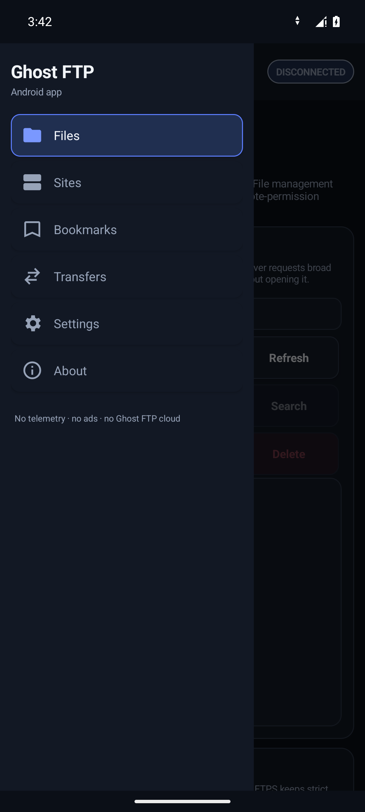

# Ghost FTP

<p align="center">
  
</p>

<h3 align="center">Your servers. Your files. Your control.</h3>

<p align="center">
Privacy-first FTP, FTPS and SFTP software for direct professional file transfer without telemetry, advertising, mandatory product accounts or a hidden storage cloud.
</p>

<p align="center">
  <a href="docs/INSTALLATION.md"><strong>Install</strong></a> ·
  <a href="docs/SECURITY.md"><strong>Security</strong></a> ·
  <a href="docs/PRIVACY.md"><strong>Privacy</strong></a> ·
  <a href="docs/README.md"><strong>Documentation</strong></a>
</p>

---

## Product surfaces

Ghost FTP keeps protocol traffic on the user's device and the destination server selected by the user. The repository contains maintained native applications for Windows, Linux and Android, an active macOS native source surface, and browser extension packages.

The product website and former browser-hosted FTP client are not part of this repository. Browser packages are maintained under [`extensions/`](extensions/README.md). On the 0.0.7 development branch they use a bounded local Native Messaging bridge backed by the existing Ghost FTP Engine; they do not pretend that browser JavaScript can open raw FTP/SFTP sockets and they do not route transfers through a Ghost FTP remote proxy.

No application telemetry. No behavioral analytics. No advertising. No fingerprinting. No mandatory Ghost FTP account. No automatic third-party crash upload.

## Core capabilities

The native product is built around real connection, navigation and transfer operations:

- FTP and explicit FTPS;
- SFTP on platforms where strict host-key verification is implemented;
- saved connections with platform-local protected credential handling;
- local and remote navigation;
- upload and download;
- create directory, rename and delete;
- transfer progress, speed, cancellation and retry;
- queue lifecycle and ordering;
- bookmarks, filtering, search and comparison;
- bounded Remote Edit where supported.

Security-sensitive features fail closed. Unsupported features stay hidden rather than being simulated.

## Platforms

| Platform | Status | Boundary |
| --- | --- | --- |
| **Windows** | Public release / reference UX | Universal Setup + Portable, x64/x86/ARM64 payloads |
| **Linux** | Public release | Debian, Ubuntu and Fedora Installer + Portable bundles |
| **Android** | Public release | Production-signed APK; FTP + strict explicit FTPS; SAF-scoped storage |
| **macOS** | Active native source | Public distribution remains gated on Developer ID signing and notarization |
| **Browser extensions** | Public release packages / 0.0.7 bridge development | Chrome, Edge, Firefox and Opera UI over the local Ghost FTP Native Messaging bridge; `nativeMessaging` is the only browser permission |

## Published release

Current source version: **0.0.6**
Latest published GitHub Release: **`ghostftp-v0.0.6`**
Published: **14 September 2026**
Channel: **Current**
Prerelease: **false**

The published 0.0.6 release is immutable release history. Work on `production/0.0.7-cleanup` prepares the source for the next development cycle and does not retag, rewrite or republish 0.0.6.

The 0.0.6 publication contract is **13 platform artifacts / 16 public files**:

```text
Ghost-FTP-0.0.6-Setup.exe
Ghost-FTP-0.0.6-Portable.exe
Ghost-FTP-0.0.6-Linux-Debian-Installer.run
Ghost-FTP-0.0.6-Linux-Debian-Portable.tar.gz
Ghost-FTP-0.0.6-Linux-Ubuntu-Installer.run
Ghost-FTP-0.0.6-Linux-Ubuntu-Portable.tar.gz
Ghost-FTP-0.0.6-Linux-Fedora-Installer.run
Ghost-FTP-0.0.6-Linux-Fedora-Portable.tar.gz
Ghost-FTP-0.0.6-Android.apk
Ghost-FTP-0.0.6-Chrome-Extension.zip
Ghost-FTP-0.0.6-Edge-Extension.zip
Ghost-FTP-0.0.6-Firefox-Extension.zip
Ghost-FTP-0.0.6-Opera-Extension.zip
BUILD-METADATA.txt
RELEASE-NOTES.txt
SHA256.txt
```

Canonical release identity:

```text
VERSION=0.0.6
TAG=ghostftp-v0.0.6
CHANNEL=Current
PRERELEASE=false
PUBLIC_PLATFORM_ARTIFACTS=13
PUBLIC_RELEASE_FILES=16
WINDOWS_NATIVE_PAYLOADS=x64,x86,arm64
WINDOWS_ARM64_RUNTIME_EVIDENCE=not-native-ci
```

Official Windows publication is signed-only. Android publication requires the protected production signing identity and exact `GHOSTFTP_ANDROID_CERT_SHA256` match. The verified distribution bundle is `ghcr.io/bren-wp/ghost-ftp:0.0.6` and is distribution infrastructure, not a runtime service.

## Authentic runtime evidence

The maintained documentation uses repository-local, exact-head runtime captures. Mockups and generated approximations are not accepted as runtime evidence. The verified 0.0.6 evidence bundle covers **Windows, Linux and Android**, with capture source `9adace20030a300c39eb320a97482eb50dfdb9d8` from workflow run `34863585111`.

### Windows


<table>
<tr>
<td width="50%"><strong>Site Manager</strong><br></td>
<td width="50%"><strong>Settings</strong><br></td>
</tr>
<tr>
<td width="50%"><strong>Bookmarks</strong><br></td>
<td width="50%"><strong>About</strong><br></td>
</tr>
</table>

### Linux

<table>
<tr>
<td width="50%"></td>
<td width="50%"></td>
</tr>
<tr><td colspan="2"></td></tr>
</table>

### Android

<table>
<tr>
<td width="33%"></td>
<td width="33%"></td>
<td width="33%"></td>
</tr>
<tr>
<td width="33%"></td>
<td width="33%"></td>
<td width="33%"></td>
</tr>
<tr><td colspan="3"></td></tr>
</table>

See [Reference UI](docs/REFERENCE-UI.md) for the complete 15-image evidence contract.

## Localization

English is the canonical default and first language. Ghost FTP provides **24 selectable desktop languages** through the shared localization registry, with live Windows localization and the maintained Linux terminal localization surface. Windows Setup derives its language list from the same registry so installer and runtime language support cannot silently drift apart.

## Quality and security gates

```text
gofmt
go test -race ./...
go vet ./...
python scripts/audit_repository.py
python scripts/audit_dependencies.py
python scripts/audit_security.py
python scripts/audit_privacy.py
python scripts/audit_docs.py
python scripts/audit_release.py
python -m unittest discover -s scripts -p 'test_*.py'
```

CI also validates Windows, Linux, Android, browser packages, CodeQL, Govulncheck and exact-head runtime evidence. Tests and security checks are not bypassed to make a branch green.

## License

Ghost FTP is proprietary commercial software owned by **Brendigo LTD**. Source visibility does not grant a general right to modify, redistribute, sublicense, rebrand or white-label the product. See [`LICENSE`](LICENSE) and [`docs/THIRD-PARTY-NOTICES.md`](docs/THIRD-PARTY-NOTICES.md).

---

<p align="center"><strong>Ghost FTP</strong><br>Your servers. Your files. Your control.</p>
