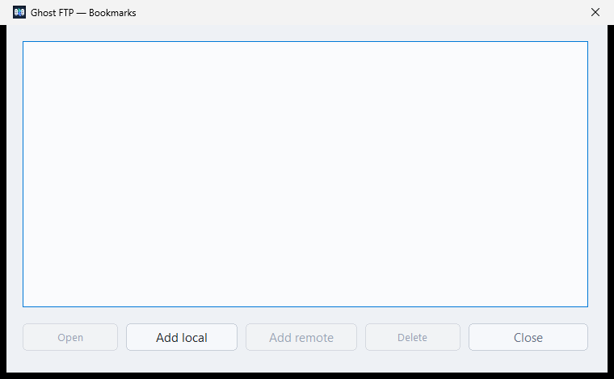
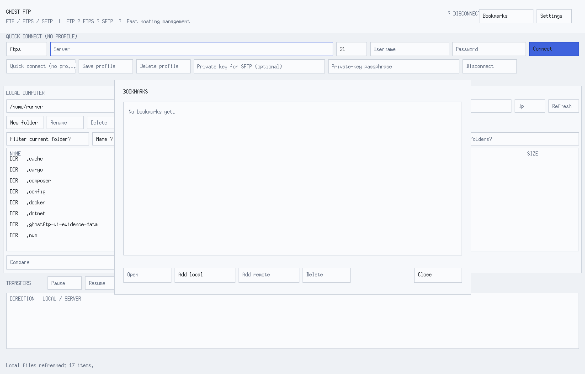
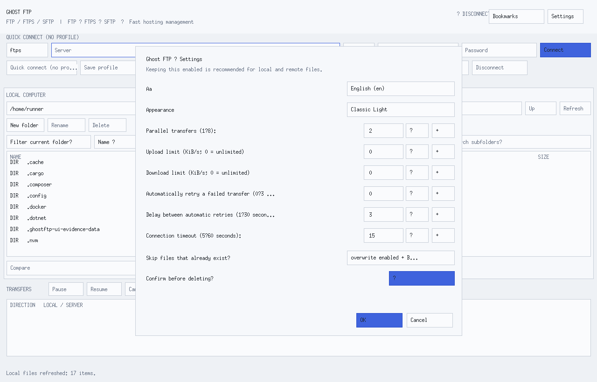
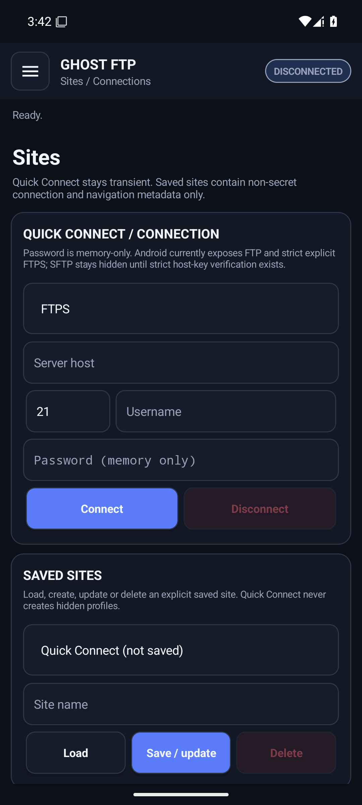
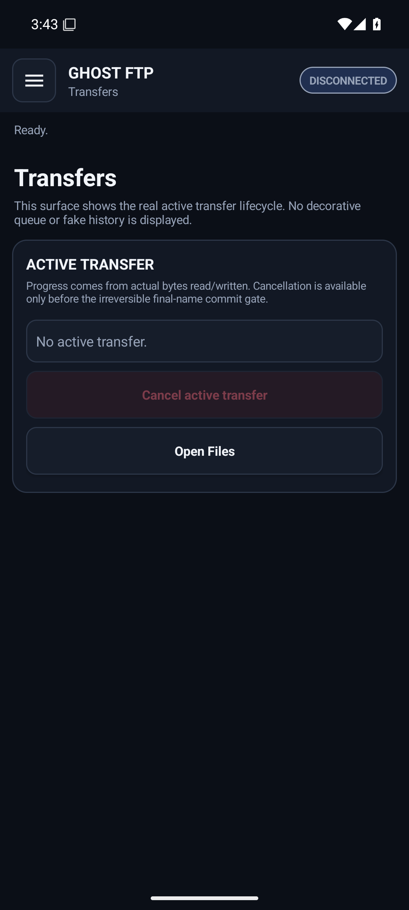
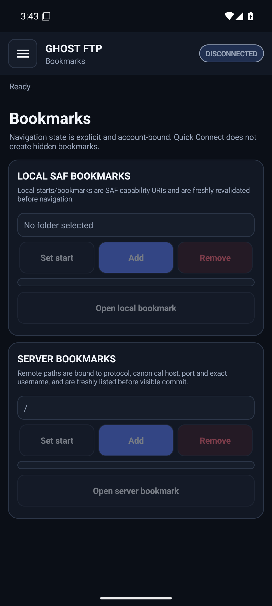
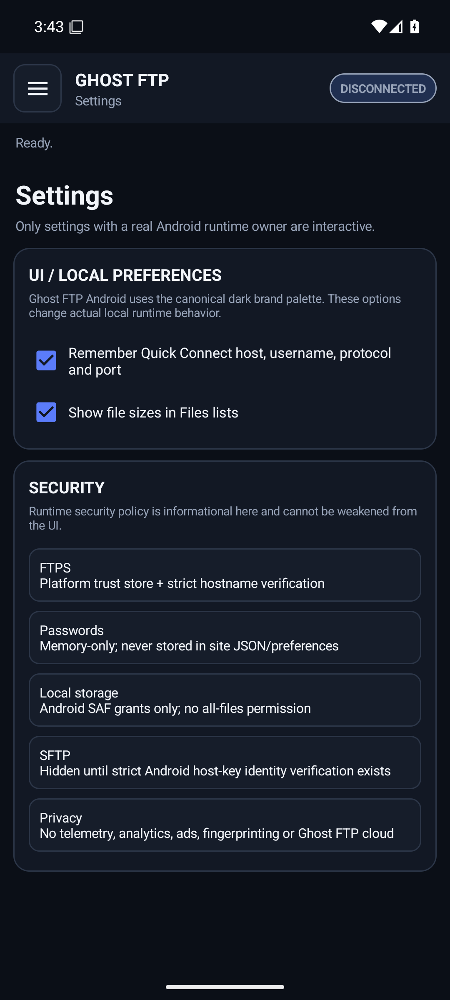
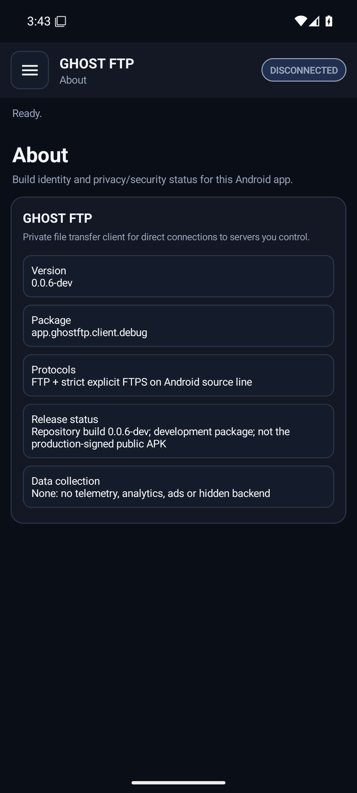

# Ghost FTP

<p align="center">
  
</p>

<h3 align="center">Your servers. Your files. No cloud middleman.</h3>

<p align="center">
A privacy-first FTP, explicit FTPS and SFTP workspace for people who want serious file transfer without telemetry, ads, a mandatory product account or a hidden storage cloud.
</p>

<p align="center">
  <a href="https://ghostftp.com"><strong>Website</strong></a> ·
  <a href="https://ghostftp.com/ftp/"><strong>Web FTP</strong></a> ·
  <a href="docs/INSTALLATION.md"><strong>Install</strong></a> ·
  <a href="docs/SECURITY.md"><strong>Security</strong></a> ·
  <a href="docs/PRIVACY.md"><strong>Privacy</strong></a> ·
  <a href="docs/README.md"><strong>Documentation</strong></a>
</p>

---

## Ghost FTP 0.0.6

- Current source version: **0.0.6**
- Release channel: **Current**
- Development status: **Active**
- Last actually published GitHub Release: **0.0.5**
- Next public release target: **ghostftp-v0.0.6**, `prerelease=false`
- Public 0.0.6 target: **13 platform artifacts / 16 public files**
- Product website source: [`web/`](web/README.md)
- Browser client source: [`web/ftp/`](web/ftp/README.md)
- License: **proprietary commercial software — Copyright © 2026 Brendigo LTD. All rights reserved.**

0.0.6 is published only after the **exact final head SHA** is merged to `main`, the complete post-merge gate succeeds, trusted Windows Authenticode succeeds, the protected Android signing identity matches `GHOSTFTP_ANDROID_CERT_SHA256`, and the release asset/readback transaction completes without drift. Development, CI-smoke, self-signed or ad-hoc identities are never substituted for production signing.

## Why Ghost FTP

Ghost FTP is built around a simple idea: **file transfer should be direct, inspectable and under your control**.

- **Direct server workflows.** Connect to infrastructure you choose instead of uploading files into a Ghost FTP storage cloud.
- **Privacy by design.** No application telemetry, behavioral analytics, advertising, fingerprinting or automatic crash upload.
- **Trust that fails closed.** Explicit FTPS validates certificate and hostname identity; maintained desktop SFTP uses strict host-key trust/pinning.
- **Real transfer controls.** Queue lifecycle, cancellation, retry, pause/resume where technically supported, priority ordering and truthful progress.
- **Real file operations.** Navigation, filters, search, directory comparison, bookmarks, remote mutations and Remote Edit are backed by actual engine capability rather than decorative controls.
- **Cross-platform delivery.** Windows is the reference desktop experience; Linux, Android and macOS are actively maintained source surfaces with capability claims tied to evidence.
- **24 desktop languages.** English is the canonical default/fallback with 23 additional maintained desktop language catalogs.
- **A real product website and Web FTP client.** `web/` is deployable to `ghostftp.com`; `web/ftp` is an ephemeral server-assisted FTP/FTPS/SFTP workspace with no registration database.

## See the actual 0.0.6 applications

These **repository-local** screenshots are authentic **exact-head** runtime captures for **Windows, Linux and Android**, imported byte-for-byte from the verified `ghostftp-authentic-ui-verified-bundle` produced by workflow run `34863585111` for source SHA `9adace20030a300c39eb320a97482eb50dfdb9d8`. The provenance manifest and SHA-256 allow-list are stored under [`docs/images/0.0.6/`](docs/images/0.0.6/). Generated mockup images, image-generation output and manually substituted screenshots are not accepted as runtime evidence.

### Windows


<table>
<tr>
<td width="50%" valign="top"><strong>Site Manager</strong><br><br></td>
<td width="50%" valign="top"><strong>Settings</strong><br><br></td>
</tr>
<tr>
<td width="50%" valign="top"><strong>Bookmarks</strong><br><br></td>
<td width="50%" valign="top"><strong>About / product identity</strong><br><br></td>
</tr>
</table>

### Linux

<table>
<tr>
<td width="50%" valign="top"><strong>Main workspace</strong><br><br></td>
<td width="50%" valign="top"><strong>Bookmarks</strong><br><br></td>
</tr>
<tr>
<td colspan="2" align="center"><strong>Settings</strong><br><br></td>
</tr>
</table>

### Android

<table>
<tr>
<td width="33%" valign="top"><strong>Files</strong><br><br></td>
<td width="33%" valign="top"><strong>Sites</strong><br><br></td>
<td width="33%" valign="top"><strong>Transfers</strong><br><br></td>
</tr>
<tr>
<td width="33%" valign="top"><strong>Bookmarks</strong><br><br></td>
<td width="33%" valign="top"><strong>Settings</strong><br><br></td>
<td width="33%" valign="top"><strong>About</strong><br><br></td>
</tr>
</table>

See [Reference UI](docs/REFERENCE-UI.md) for the full 15-image evidence contract.

## Product surfaces

| Surface | 0.0.6 status | Contract |
| --- | --- | --- |
| **Windows** | Public release target / reference UI | Exactly one universal Setup + one universal Portable, each containing x64, x86 and ARM64 payloads. Trusted Authenticode required for publication. |
| **Linux** | Active + public release target | Debian, Ubuntu and Fedora each receive one Installer + one Portable bundle; every bundle carries amd64, arm64 and i386 payloads. |
| **Android** | Active + public release target | One production-signed APK. FTP + strict explicit FTPS. SAF-scoped local storage. SFTP stays hidden until strict Android host-key verification exists. |
| **macOS** | Active development | Native AppKit frontend. No public production package until Developer ID Application signing and Apple notarization are proven. |
| **Browser helper** | Public release target | Separate deterministic ZIP for Chrome, Edge, Firefox and Opera; zero browser/host permissions and **no supported browser-to-desktop** handoff. |
| **Website** | Active source | Self-contained `web/` product site intended for `ghostftp.com`, with no third-party analytics/font/script dependency. |
| **Web FTP** | Active source | `web/ftp` uses an ephemeral **server-assisted** transport. Browsers cannot open raw FTP/FTPS/SFTP sockets directly; the application does not pretend otherwise. |

## Web FTP — browser workspace without fake direct-socket claims

`web/ftp` provides a responsive browser UI for FTP, explicit FTPS and SFTP operations: remote listing/navigation, upload, download, create directory, rename, delete, CHMOD and bounded Remote Edit.

The trust boundary is explicit:

1. the browser keeps connection values in page memory rather than a persistent product account/database;
2. the browser sends the requested operation over HTTPS to `web/ftp/api.php`;
3. PHP performs that one server operation and closes the transport;
4. the supplied application does not persist connection passwords or transfer history;
5. FTP/FTPS targets are resolved and checked against SSRF rules, then pinned for the cURL request;
6. explicit FTPS requires TLS peer + hostname verification;
7. SFTP requires an expected `SHA256:...` host-key fingerprint **before authentication**.

A public deployment should keep private/reserved destination blocking enabled and must run behind HTTPS. See [`docs/WEB.md`](docs/WEB.md).

## 0.0.6 public downloads

The canonical 0.0.6 publication contract contains **13 platform artifacts / 16 public files**. These filenames are release targets until `ghostftp-v0.0.6` is actually published by the protected workflow.

### Windows

```text
Ghost-FTP-0.0.6-Setup.exe
Ghost-FTP-0.0.6-Portable.exe
```

Both carry verified native x64, x86 and ARM64 payloads internally. Architecture-specific public EXEs are intentionally forbidden.

### Linux

```text
Ghost-FTP-0.0.6-Linux-Debian-Installer.run
Ghost-FTP-0.0.6-Linux-Debian-Portable.tar.gz
Ghost-FTP-0.0.6-Linux-Ubuntu-Installer.run
Ghost-FTP-0.0.6-Linux-Ubuntu-Portable.tar.gz
Ghost-FTP-0.0.6-Linux-Fedora-Installer.run
Ghost-FTP-0.0.6-Linux-Fedora-Portable.tar.gz
```

Each bundle contains amd64, arm64 and i386 payloads and selects the local architecture at runtime. Native installer/runtime/GUI evidence is maintained on Debian 13 amd64, Ubuntu 26.04 LTS amd64 and Fedora 44 x86_64; cross-built ARM64/i386 evidence is not mislabeled as native execution.

### Android

```text
Ghost-FTP-0.0.6-Android.apk
```

Publication requires `apksigner` verification and an exact protected `GHOSTFTP_ANDROID_CERT_SHA256` signer fingerprint match. Compatibility follows the maintained Android `minSdk`, target SDK and tested APIs; the project does not claim literal compatibility with every Android release ever made.

### Browser helpers

```text
Ghost-FTP-0.0.6-Chrome-Extension.zip
Ghost-FTP-0.0.6-Edge-Extension.zip
Ghost-FTP-0.0.6-Firefox-Extension.zip
Ghost-FTP-0.0.6-Opera-Extension.zip
```

Source lives under [`extensions/`](extensions/README.md). All four packages use one shared local runtime with browser-specific manifests.

### Release metadata

```text
BUILD-METADATA.txt
RELEASE-NOTES.txt
SHA256.txt
```

Canonical identity:

```text
VERSION=0.0.6
TAG=ghostftp-v0.0.6
CHANNEL=Current
PRERELEASE=false
PUBLIC_PLATFORM_ARTIFACTS=13
PUBLIC_RELEASE_FILES=16
WINDOWS_NATIVE_PAYLOADS=x64,x86,arm64
WINDOWS_ARM64_RUNTIME_EVIDENCE=not-native-ci
```

The exact verified release directory is additionally represented as `ghcr.io/bren-wp/ghost-ftp:0.0.6`. That OCI object is a **distribution bundle**, not a supported runtime container.

## Security model

- **FTP** is an intentional unencrypted compatibility mode.
- **Explicit FTPS** validates TLS certificate and hostname identity and does not silently downgrade.
- **Desktop SFTP** uses strict server host-key trust/pinning.
- **Android SFTP** remains hidden until a maintained strict host-key implementation exists.
- **Web SFTP** requires an expected SHA-256 server host-key fingerprint before password authentication.
- **Local destructive actions** use path/root validation and lifecycle ownership rather than blind path strings.
- **Production releases** fail closed when required signing identities are unavailable.

Read [`docs/SECURITY.md`](docs/SECURITY.md) for the maintained threat/trust boundaries.

## Privacy model

Ghost FTP does not require a product account and does not contain application telemetry, analytics, advertising, fingerprinting, hidden synchronization or an automatic crash-upload backend. Native transfer traffic goes to the server selected by the user.

Web FTP necessarily differs: because browser JavaScript cannot speak raw FTP/FTPS/SFTP, the trusted web host executes each requested operation. The supplied code is designed to avoid durable credential/profile/history storage, but the hosting operator and its infrastructure are inside that runtime trust boundary.

Read [`docs/PRIVACY.md`](docs/PRIVACY.md).

## Localization

Ghost FTP's maintained desktop catalog exposes **24 selectable desktop languages**, with **English as the canonical default and fallback**: English, Croatian, German, French, Spanish, Turkish, Greek, Portuguese, Chinese, Russian, Hindi, Japanese, Italian, Polish, Dutch, Czech, Ukrainian, Swedish, Romanian, Hungarian, Danish, Finnish, Norwegian and Korean.

Localization claims remain platform-scoped: a platform is described as fully localized only when its own maintained UI surface and catalog coverage pass the applicable audits. The product website and Web FTP use English as their current canonical source language until a complete maintained web-localization contract is added.

## Quality gates

Release-candidate checks include:

```text
gofmt
go test -race ./...
go vet ./...
python scripts/audit_brand_hardcut.py
python scripts/audit_repository.py
python scripts/audit_platform_contract.py
python scripts/audit_desktop_surface.py
python scripts/audit_dependencies.py
python scripts/audit_version.py
python scripts/audit_localization.py
python scripts/audit_security.py
python scripts/audit_privacy.py
python scripts/audit_docs.py
python scripts/audit_release.py
python -m unittest discover -s scripts -p 'test_*.py'
```

The regression suite includes the Web FTP contract and, when PHP CLI is present on the maintained Linux runner, lints every tracked Web FTP PHP source file and checks SSRF/TLS/SFTP trust markers. Platform workflows additionally verify Windows universal packaging/signing smoke, Linux bundles/install lifecycle, Android build/lint/signing pipeline, deterministic browser packages, macOS development build, CodeQL and Govulncheck.

A PR is merge-ready only when workflows for its **exact final head SHA** are terminal-successful. A release is valid only when the exact merged `main` SHA passes post-merge verification and the protected production release workflow completes publication and readback.

## Commercial proprietary license

Ghost FTP is **not open-source software** and is not offered under an OSI-approved license. Source visibility does not grant a general right to modify, redistribute, sublicense, rebrand, white-label or incorporate Ghost FTP into another product.

Ghost FTP and its source code, binaries, UI, website, Web FTP implementation, documentation, branding, icons and release engineering are copyrighted works of **Brendigo LTD**. See [`LICENSE`](LICENSE) for the controlling terms and [`docs/THIRD-PARTY-NOTICES.md`](docs/THIRD-PARTY-NOTICES.md) for independent third-party components.

## Documentation

Start with [`docs/README.md`](docs/README.md), then use:

- [Installation](docs/INSTALLATION.md)
- [Architecture](docs/ARCHITECTURE.md)
- [Platform parity](docs/PLATFORM-PARITY.md)
- [Web / Web FTP](docs/WEB.md)
- [Security](docs/SECURITY.md)
- [Privacy](docs/PRIVACY.md)
- [Signing](docs/SIGNING.md)
- [Release verification](docs/RELEASE-VERIFICATION.md)
- [Testing](docs/TESTING.md)
- [Reference UI](docs/REFERENCE-UI.md)
- [Roadmap](docs/ROADMAP.md)

<p align="center"><strong>Ghost FTP — direct file transfer with verifiable boundaries.</strong></p>
