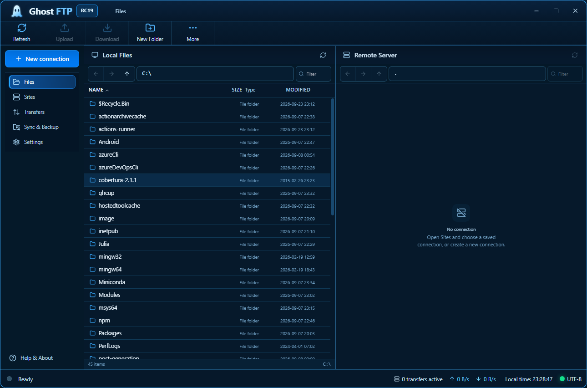

<div align="center">


### More Than Transfer. Total Control.

**A modern, privacy-first FTP / FTPS / SFTP client for Windows, Linux and Android.**

[Website](https://ghostftp.com/) ·
[Releases](https://github.com/bren-wp/Ghost-FTP/releases) ·
[Documentation](docs/README.md) ·
[Security](SECURITY.md) ·
[Changelog](CHANGELOG.md)

</div>

<p align="center">
  <a href="docs/assets/screenshots/ghostftp-native-files.png"></a>
</p>

<p align="center"><sub><strong>Actual native application screenshot.</strong> Captured automatically from the Windows native QA workflow at the canonical 1290×852 viewport.</sub></p>

## Ghost FTP 2.1.1 RC22

Ghost FTP 2.1.1 RC22 is the multiplatform release line for:

- Windows x64 portable executable.
- Windows x64 setup executable.
- Linux x86_64 binary.
- Linux x86_64 AppImage.
- Linux amd64 DEB package.
- Linux x86_64 RPM package.
- Android APK.
- Source, website, update templates, documentation and SHA-256 checksum bundles.

RC22 keeps the Windows/Linux desktop release path and adds the native Android app into the same release train. Android is built from `/android`, uses the same Ghost FTP / Brendigo product identity, and is released as an installable APK without requiring GitHub signing secrets.

## Core product

Ghost FTP brings secure server connections, dual-pane file management, saved sites, transfer queues, synchronization, checksums, permissions, terminal tools and practical server workflows into one consistent product.

<table>
<tr><td width="52"></td><td><strong>Secure connections</strong><br>FTP, explicit FTPS and SFTP with native TLS/SSH verification paths and protected credential handling where supported.</td></tr>
<tr><td></td><td><strong>Fast transfers</strong><br>Concurrent queues, pause/resume, retries, conflict handling and bandwidth controls.</td></tr>
<tr><td></td><td><strong>One workspace</strong><br>Local and remote browsing, Site Manager, permissions, checksums, sync, search and terminal tools.</td></tr>
<tr><td></td><td><strong>Privacy first</strong><br>No required analytics or telemetry. Sensitive profile secrets stay outside ordinary profile JSON where supported.</td></tr>
<tr><td></td><td><strong>Desktop + mobile</strong><br>Windows, Linux and Android release artifacts are generated through GitHub Actions.</td></tr>
</table>

## Android RC22

The Android app is native Kotlin and uses a single mobile-first application surface:

- Header with Ghost FTP RC22 release identity.
- Session status card.
- Connection card for FTP, explicit FTPS and SFTP.
- SFTP SHA-256 host key fingerprint field.
- Remote workspace with folder listing.
- Transfer queue state.
- Brendigo footer.
- No analytics, no telemetry and no account requirement.

Android credentials are passed only into the active connection action. Passwords are cleared on disconnect. SFTP does not disable strict host-key checking.

## Build

Desktop:

```bash
cd ghostftp-desktop
npm ci
npm run build
```

Android:

```bash
gradle -p android lintDebug lintRelease assembleDebug assembleRelease
```

## Release gates

RC22 release is valid only after these GitHub Actions pass:

- Ghost FTP quality.
- Ghost FTP protocol E2E.
- Ghost FTP native build.
- Ghost FTP Android.
- RC22 release packaging.

The release must include SHA-256 checksums for the published artifacts.

## Repository layout

```text
Ghost-FTP/
├── android/                 Native Android application and APK workflow
├── ghostftp-desktop/        Production Windows/Linux desktop application
├── website/                 ghostftp.com source
├── updates/                 Update channels, manifest schema and tools
├── tools/                   Runtime and installer support tooling
├── docs/                    Product, QA, release, legal and development docs
├── .github/workflows/       Quality, native build, Android and release automation
├── README.md
├── CHANGELOG.md
├── SECURITY.md
├── LICENSE.txt
└── EULA.txt
```

Use **Ghost FTP** in user-facing copy and **GhostFTP** in executable/archive names. Framework-specific names are kept only where the build ecosystem requires them internally.

<div align="center">

**Ghost FTP**  
*More Than Transfer. Total Control.*  
**Simple. Secure. Powerful.**

Publisher: **Brendigo**  
Official website: **https://ghostftp.com/**

</div>
