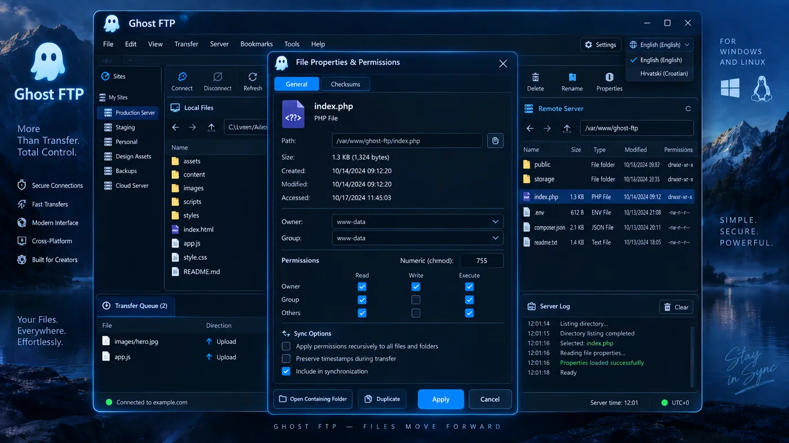
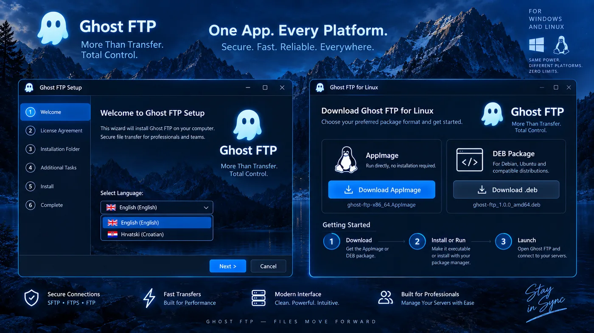

<p align="center">
  
</p>

<h1 align="center">Ghost FTP</h1>

<p align="center"><strong>More Than Transfer. Total Control.</strong></p>

<p align="center">
  A privacy-first native file-transfer workspace for Windows and Linux.<br>
  FTP, FTPS and SFTP with a focused dual-pane workflow, transfer control and server organization.
</p>

<p align="center">
  <a href="https://github.com/bren-wp/Ghost-FTP-Premium/actions/workflows/native-build.yml"></a>
  <a href="https://github.com/bren-wp/Ghost-FTP-Premium/actions/workflows/source-audit.yml"></a>
  <a href="https://github.com/bren-wp/Ghost-FTP-Premium/releases"></a>
  
  
  
</p>

<p align="center">
  <a href="https://ghostftp.com/">Website</a> ·
  <a href="https://github.com/bren-wp/Ghost-FTP-Premium/releases">Downloads</a> ·
  <a href="docs/README.md">Documentation</a> ·
  <a href="docs/PROJECT-STATUS.md">Project status</a> ·
  <a href="SECURITY.md">Security</a>
</p>

---

<p align="center">
  
</p>

## Your files. Your servers. One focused workspace.

Ghost FTP is designed for developers, administrators, creators and hosting users who need more control than a basic upload dialog. Local and remote files remain visible together, transfer state stays explicit, and server profiles are organized around real day-to-day work.

### What Ghost FTP already includes

| Area | Implemented |
| --- | --- |
| Connections | FTP, FTPS, SFTP, Quick Connect, saved profiles, recent servers |
| File management | Dual-pane browser, upload/download, rename, delete, folders, properties |
| Transfer control | Queue, progress, speed, ETA, pause/resume/cancel/retry paths |
| Organization | Site Manager, favorites, folders, tags, bookmarks |
| Integrity | SHA-256 where supported, permission/chmod controls, protocol-aware errors |
| Security | OS-protected credentials where supported, TLS/SSH verification paths, signed updater |
| Privacy | No required analytics or telemetry |
| Platforms | Windows x64 and Linux x86-64 |
| Languages | English + 13 additional interface languages |

## Designed as Ghost FTP — not a browser shell

RC10 keeps the end-user application on the native GhostFTP desktop path. The old compatibility browser-host executable is not an accepted production GUI because visible browser/origin chrome breaks the approved frameless design.

The approved desktop reference remains **1290 × 852**. At that size the layout follows the reference geometry; smaller windows adapt through compact controls and local scrolling instead of removing essential actions.

<table>
<tr>
<td width="50%"></td>
<td width="50%"></td>
</tr>
<tr>
<td align="center"><strong>Site Manager</strong><br>Profiles, favorites, tags, folders and connection details.</td>
<td align="center"><strong>New Connection</strong><br>Protocol, host, credentials, passive mode and SSH-key options.</td>
</tr>
</table>

<table>
<tr>
<td width="50%"></td>
<td width="50%"></td>
</tr>
<tr>
<td align="center"><strong>Transfer Center</strong><br>Progress, speed, ETA, scheduling, bandwidth and logs.</td>
<td align="center"><strong>Preferences</strong><br>Language, appearance, transfers, connection, privacy and updates.</td>
</tr>
</table>

<table>
<tr>
<td width="50%"></td>
<td width="50%"></td>
</tr>
<tr>
<td align="center"><strong>File Properties</strong><br>Metadata, checksums and permission controls where supported.</td>
<td align="center"><strong>About & Updates</strong><br>Version, platform, update state, changelog and support.</td>
</tr>
</table>

## Visual identity

<p align="center">
  
</p>

Ghost FTP uses a consistent dark desktop system built around:

- **Electric Blue** — `#38ABFF`
- **Deep Navy** — `#0B1E36`
- **Slate Blue** — `#132D52`
- **Ice White** — `#EAF6FF`

The reference screenshots are retained only as visual/QA specifications. The application UI is built from real interactive components; screenshots are never used as clickable runtime backgrounds.

## Windows + Linux

<p align="center">
  
</p>

| Platform | RC10 release files |
| --- | --- |
| Windows x64 | Portable EXE, Setup EXE, Windows ZIP |
| Linux x86-64 | Native executable, AppImage, DEB, RPM, Linux TAR.GZ |

Release filenames use the same order everywhere: **GhostFTP → version → platform → architecture → role**.

Examples:

`GhostFTP-2.1.1-RC10-Windows-x64-Portable.exe`  
`GhostFTP-2.1.1-RC10-Windows-x64-Setup.exe`  
`GhostFTP-2.1.1-RC10-Linux-x86_64.AppImage`

## Repository layout

```text
Ghost-FTP-Premium/
├── ghostftp-desktop/      # Production GhostFTP desktop application
│   ├── branding/          # Logo and GhostFTP symbol
│   ├── packages/          # Shared GhostFTP UI packages
│   ├── src/               # Desktop interface
│   └── src-tauri/         # Framework-required native Rust directory
├── ghostftp-web/          # Product website source
├── ghostftp-runtime/      # Developer/compatibility runtime tooling
├── ghostftp-installer/    # Developer/setup compatibility tooling
├── updates/               # Update metadata/resources
├── docs/
│   ├── assets/            # README and visual QA media
│   ├── audits/            # Code, branding, language and security audits
│   ├── build/             # Build and release status
│   ├── guides/            # Installation, support, uninstall and updates
│   ├── legal/             # Privacy and third-party notices
│   ├── qa/                # Interaction, transfer, responsive and pixel QA
│   ├── releases/          # Release notes
│   └── roadmap/           # Implemented features and recommended next work
└── .github/workflows/     # Quality audit, desktop build and release automation
```

Only the internal `src-tauri/` name is retained because it is a framework convention used by the native build tooling. Product-facing folders, workflows, artifacts and documentation use **GhostFTP** naming.

## Build from source

Requirements: Node.js 22+, npm, stable Rust/Cargo and the platform prerequisites required by the desktop framework.

```bash
cd ghostftp-desktop
npm ci
npm run check
npm run build
npm run ghostftp -- build
```

The production release pipeline is GitHub Actions. It runs a quality audit first, builds Windows/Linux native packages, normalizes artifact names and publishes the release candidate only when both gates succeed.

## Quality gates

RC10 requires:

- TypeScript typecheck + production frontend build;
- Go tests/vet for GhostFTP tooling;
- JavaScript syntax checks;
- Rust formatting, workspace check, tests and Clippy with warnings denied;
- legacy/demo branding scan;
- Windows and Linux desktop package builds;
- deterministic release filenames and SHA-256 checksums.

The project is **not** labelled FINAL until the remaining OS-level evidence is complete. See [Project Status](docs/PROJECT-STATUS.md), [Build Status](docs/build/STATUS.md), [Pixel Parity](docs/qa/PIXEL_PARITY.md), [Responsive QA](docs/qa/RESPONSIVE.md) and [Titlebar QA](docs/qa/TITLEBAR.md).

## Documentation

Start with **[docs/README.md](docs/README.md)**.

For the clearest overview of what is finished, what exists today and what is recommended next, read:

- [Project Status](docs/PROJECT-STATUS.md)
- [Feature Matrix](docs/roadmap/FEATURE-MATRIX.md)
- [Recommended Roadmap](docs/roadmap/ROADMAP.md)
- [Build Status](docs/build/STATUS.md)
- [Security](SECURITY.md)
- [Privacy](docs/legal/PRIVACY.md)

---

<p align="center">
  <br>
  <strong>Ghost FTP — Files Move Forward.</strong><br>
  <sub>© 2026 Brendigo LTD and Brendigo, obrt za programiranje. All rights reserved.</sub>
</p>
