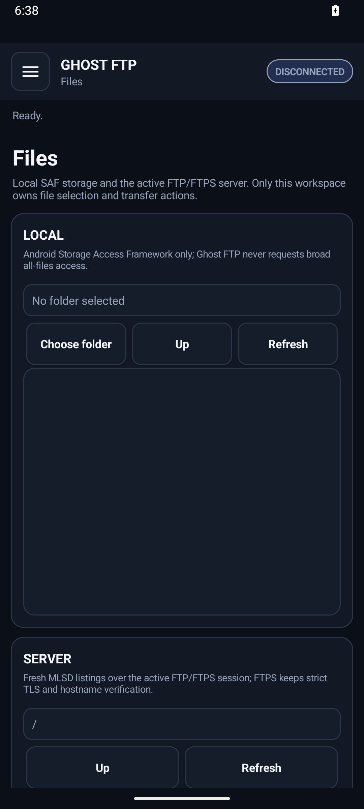

<div align="center">
  
  <h1>Ghost FTP</h1>
  <p><strong>One client. Three platforms. Zero friction.</strong></p>
  <p>Fast, privacy-first file transfer with zero telemetry.</p>
  <p>Windows · Linux · Android</p>
</div>

Ghost FTP is a privacy-first FTP/FTPS/SFTP client built around a focused dual-pane workflow. The product keeps connection management, file operations, bookmarks and transfer state in one consistent Ghost FTP interface while preserving platform-native lifecycle and security behavior.

> Current source version: **0.0.8** · Last actually published GitHub Release: **0.0.8**
>
> **Development status:** the immutable published release remains **0.0.8**. Current `main` contains post-release work for the next version. Existing 0.0.8 tags and release assets are never rewritten.
>
> Release channel: **Current** · Product status: **Current** · Prerelease: **false**
>
> Machine-readable release state: `PRERELEASE=false`
>
> Next-line distribution contract: **13 platform artifacts / 16 public files** · Distribution mode: **no-secret public release**

## Product experience

<table>
<tr>
<td width="33%" valign="top" align="center"><br><strong>Dual-pane transfers</strong><br><sub>Local and remote files, upload/download, queue state, retry and completion controls.</sub></td>
<td width="33%" valign="top" align="center"><br><strong>Secure by default</strong><br><sub>Strict FTPS validation, desktop SFTP host-key trust and fail-closed release/security boundaries.</sub></td>
<td width="33%" valign="top" align="center"><br><strong>Privacy-first</strong><br><sub>No product telemetry, ads or background upload of FTP credentials, paths or transfer contents.</sub></td>
</tr>
</table>

The primary Files workspace follows the maintained Ghost FTP reference composition:

- **Files / Connections / Transfer Queue / Settings** primary navigation;
- connection address, live status and **Quick Connect** at the top;
- **Back / Forward / Refresh / New Folder / Upload / Download / Bookmarks / More** in the main action row;
- **Local Files** and **Remote Files** panes with file metadata;
- **Transfer Queue** with File, Direction, Progress, Status, Speed and ETA;
- real engine-backed advanced actions behind **More** rather than decorative controls.

## Authentic application screenshots

These are repository-maintained runtime captures. They are product evidence, not generated mockups.

### Windows


### Linux


### Android

<p align="center">
  
</p>

Additional authentic surfaces are available under [`docs/images/`](docs/images/).

## Supported applications

| Platform | Product surface | Distribution |
| --- | --- | --- |
| **Windows** | Native Ghost FTP desktop application | Setup + Portable |
| **Linux** | Native Ghost FTP desktop application | Debian/Ubuntu/Fedora installer + portable bundles |
| **Android** | Native Ghost FTP mobile application | APK |
| **Browser helpers** | Local Chrome/Edge/Firefox/Opera companion packages | Optional helpers; not separate FTP engines |

**macOS is retired from active source and release support.** The AppKit application, Darwin-only implementation files, macOS workflows and macOS-specific tests are intentionally removed from the current product line.

The retired website and Web FTP implementation are intentionally not part of this repository or product runtime.

## Core features

- FTP, FTPS and desktop SFTP workflows;
- dual-pane local/remote file browsing;
- saved connections and Quick Connect;
- upload/download with real transfer queue state;
- pause, resume, cancel, retry and clear-completed controls where supported;
- file/folder create, rename and delete;
- remote permissions and Remote Edit on supported desktop surfaces;
- bookmarks and bounded Back/Forward navigation;
- recursive search, filters and directory comparison;
- platform-local settings and language selection;
- no product telemetry or ads.

Android intentionally hides SFTP until the maintained Android implementation can provide the required strict host-key verification boundary.

## Product terminology

English is the canonical product language and fallback. Shipping surfaces use the same core labels across platforms: **Files**, **Connections/Sites**, **Transfer Queue/Transfers**, **Settings**, **Local Files**, **Remote Files**, **Quick Connect**, **Bookmarks** and **More**. Localized UI must not expose developer placeholders or clip essential action labels.

## Downloads and release identity

The repository root [`VERSION`](VERSION) is the only product version source. Release tags use:

`ghostftp-v<version>`

Published tags are immutable. If source changes after a release, the next release uses a higher version.

The official release workflow publishes the supported Windows, Linux and Android application artifacts plus optional browser-helper packages. Release metadata and SHA-256 checksums are generated from exact release source.

Representative artifact names for the current source identity:

- `Ghost-FTP-0.0.8-Linux-Debian-Installer.run`
- `Ghost-FTP-0.0.8-Linux-Fedora-Portable.tar.gz`
- `Ghost-FTP-0.0.8-Android.apk`
- `Ghost-FTP-0.0.8-Opera-Extension.zip`

For the current source version these resolve to `Ghost-FTP-0.0.8-...`. The published tag identity is `ghostftp-v0.0.8`. The historical 0.0.8 release may still contain its previously published macOS asset; published assets are immutable, but macOS is not part of future active release assembly.

## Security and privacy

Ghost FTP keeps protocol traffic between the application and the server selected by the user. It does not require a Ghost FTP storage cloud.

Security boundaries include:

- verified FTPS TLS;
- strict desktop SFTP host-key trust/pinning;
- protected platform-local credential handling where implemented;
- no telemetry;
- no analytics;
- no advertising SDK;
- no secret-bearing browser handoff;
- release signing and verification gates that fail closed.

See [Security](docs/SECURITY.md), [Privacy](docs/PRIVACY.md) and [Signing](docs/SIGNING.md).

## Build and validation

Typical repository validation includes:

```bash
go test ./...
go vet ./...
python3 scripts/audit_security.py
python3 scripts/audit_privacy.py
```

Platform workflows additionally validate Windows packaging/runtime behavior, Linux distro bundles/install lifecycle, Android APK behavior, CodeQL, Govulncheck and authentic runtime screenshots.

## Documentation

Start with the [documentation index](docs/README.md).

Key documents:

- [Architecture](docs/ARCHITECTURE.md)
- [Installation](docs/INSTALLATION.md)
- [Reference UI](docs/REFERENCE-UI.md)
- [Platform parity](docs/PLATFORM-PARITY.md)
- [Testing](docs/TESTING.md)
- [Release verification](docs/RELEASE-VERIFICATION.md)
- [Versioning](docs/VERSIONING.md)
- [Security](docs/SECURITY.md)
- [Privacy](docs/PRIVACY.md)

## Commercial proprietary software

Ghost FTP is proprietary, source-available software governed by the repository [`LICENSE`](LICENSE). Public source visibility does not grant open-source redistribution, rebranding, sublicensing or derivative-distribution rights beyond the license and applicable law.

## Product rules

Ghost FTP changes follow four release principles:

1. **Real behavior before visual claims** — buttons and status surfaces must be backed by real application state.
2. **Authentic runtime evidence** — generated mockups are not release evidence.
3. **Security boundaries do not regress for visual parity.**
4. **Published versions are immutable.**

<div align="center">
  
  <br>
  <strong>Ghost FTP</strong>
</div>

## Windows architecture evidence

```text
WINDOWS_NATIVE_PAYLOADS=x64,x86,arm64
WINDOWS_ARM64_RUNTIME_EVIDENCE=not-native-ci
```

The public Windows Setup and Portable launchers carry x64, x86 and ARM64 native payloads. CI verifies the ARM64 payload structure and PE identity, but does not claim native ARM64 runtime execution; that limitation is recorded explicitly by `WINDOWS_ARM64_RUNTIME_EVIDENCE=not-native-ci`.
