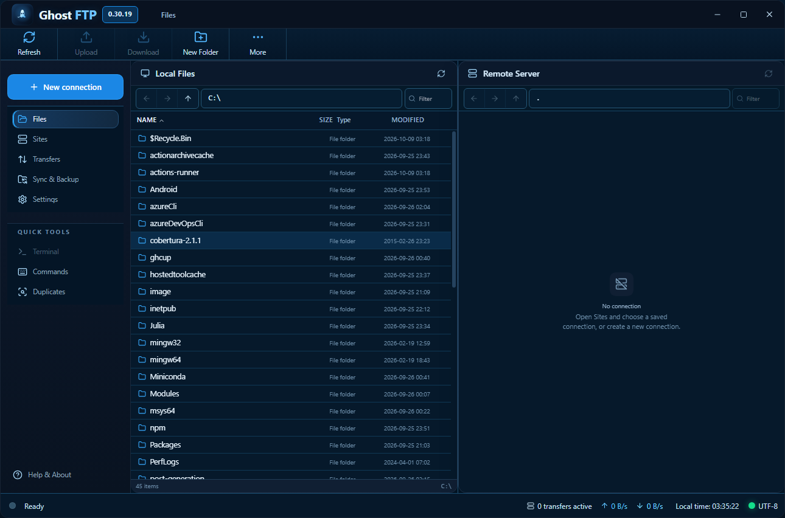
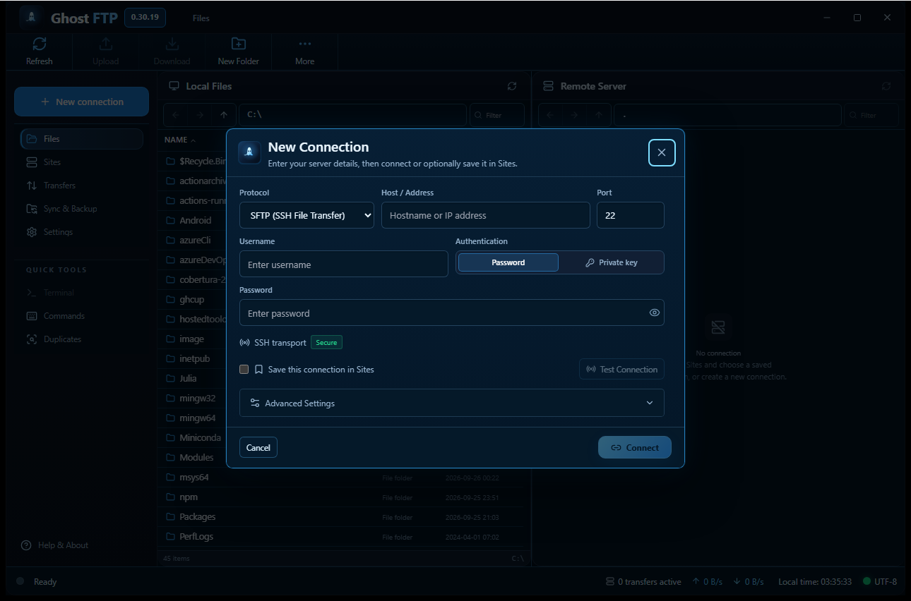
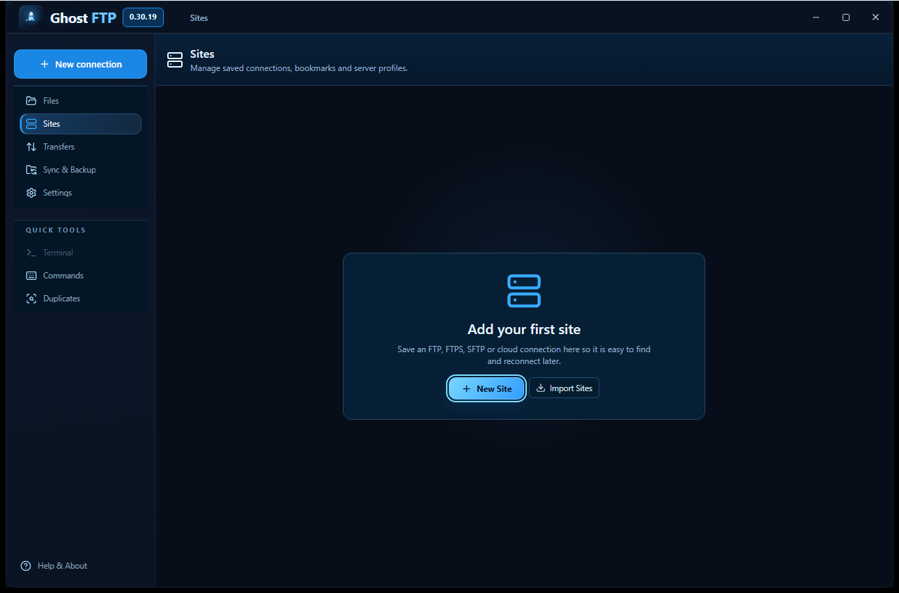
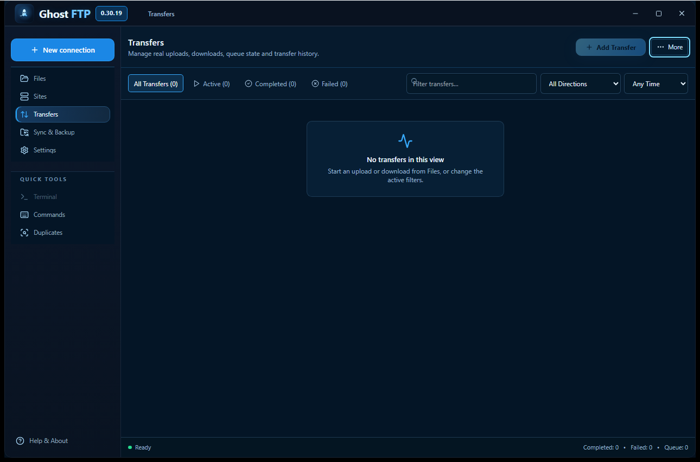
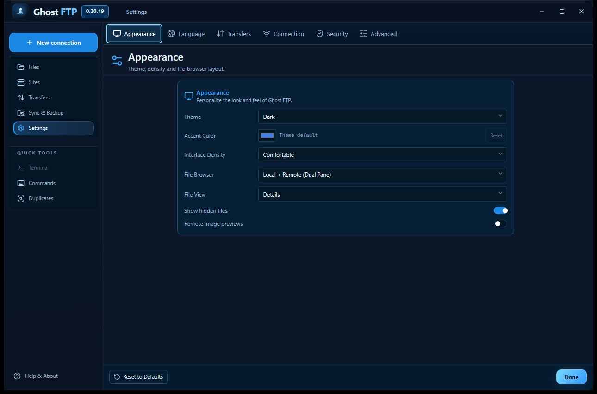
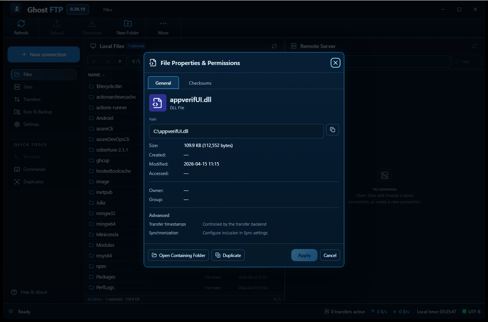
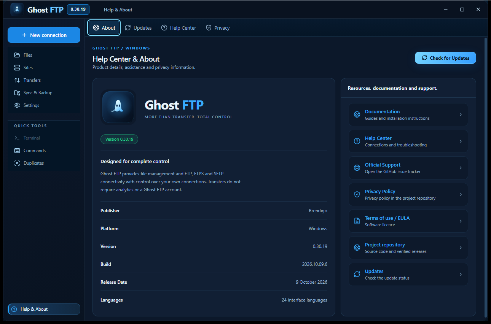

<div align="center">

Current source/release cycle: **0.92.2**. Previous canonical release: **0.92.1**. Source-verified 0.30.11 and 0.30.12 builds are handled by the historical release recovery workflow.


### More Than Transfer. Total Control.

**A privacy-first FTP / FTPS / SFTP client for Windows, Linux and Android, with a dedicated macOS client now in active development.**

[Releases](https://github.com/bren-wp/Ghost-FTP/releases) ·
[Documentation](docs/README.md) ·
[Security](SECURITY.md) ·
[Privacy](docs/legal/PRIVACY.md) ·
[Changelog](CHANGELOG.md)

</div>

<p align="center">
  <a href="docs/assets/screenshots/ghostftp-native-files.png"></a>
</p>

<p align="center"><sub><strong>Real native application screenshot.</strong> README/documentation images are CI-verified against the newest published Ghost FTP release tag.</sub></p>

## Application gallery

<table>
<tr>
<td width="50%"><a href="docs/assets/screenshots/ghostftp-native-new-connection.png"></a><br><strong>New Connection</strong></td>
<td width="50%"><a href="docs/assets/screenshots/ghostftp-native-sites.png"></a><br><strong>Sites</strong></td>
</tr>
<tr>
<td><a href="docs/assets/screenshots/ghostftp-native-transfers.png"></a><br><strong>Transfers</strong></td>
<td><a href="docs/assets/screenshots/ghostftp-native-settings.png"></a><br><strong>Settings</strong></td>
</tr>
<tr>
<td><a href="docs/assets/screenshots/ghostftp-native-file-properties.png"></a><br><strong>File properties</strong></td>
<td><a href="docs/assets/screenshots/ghostftp-native-about.png"></a><br><strong>Help & About</strong></td>
</tr>
</table>

## Current status

- **Active source/release cycle:** `0.92.2`.
- **Previous canonical release:** `0.92.1`.
- **Version source of truth:** root `version.json`.
- **Production desktop source:** `ghostftp-desktop/` — one native Tauri/React/Rust product used by Windows and Linux.
- **Production Android source:** `android/` — native Kotlin mobile application aligned to the same Files/Sites/Transfers connection and action model.
- **macOS development source:** `macos/` — dedicated SwiftUI client with its own security/build gate. 0.30.13 extends the separately verified macOS Preview with the same six-workspace shell used by the Windows/Linux reference, credential-free transfer history and password-free site backup/restore in addition to real plain-FTP browsing/upload/download; it is not yet a notarized production deliverable.
- **No website application is maintained in this repository.** Releases, source, documentation and support/security material live in GitHub/repository artifacts.

## Product scope

Ghost FTP combines secure server connections, local/remote file management, saved Sites, transfer queues, synchronization, checksums, permissions, terminal tools and server workflows in a single desktop product. Android follows the same core connection/file-action terminology using a touch-first layout.

### Secure connections

FTP, explicit FTPS and SFTP with TLS/SSH verification, protected credential handling where supported, timeout/cleanup controls and guarded remote mutations.

### Files and transfers

Local/remote browsing, upload/download, folder creation, rename/delete/properties, concurrent transfer queues, pause/resume/retry, conflict handling and bandwidth controls. Desktop transfer history is persisted without credentials so interrupted work remains visible after restart; recovered retries restart safely from byte zero unless file identity can be proven. The 0.30.2 development line extends the published 0.30.1 foundation with fail-safe local download promotion, stricter remote replacement checks and protocol-aware Android connection UX while retaining strict transfer-conflict safety, changed-host-key/permission/Unicode/zero-byte protocol coverage and non-aligned multi-chunk resume tests. Stable GitHub packages do not require private updater keys; signed in-app updater assets are published only when the complete verified signature/manifest/package set exists.

### Productivity

Sites, Sync & Backup, terminal tools, command palette, snippets, shortcuts, checksums, permissions and platform integration.

### Privacy

No required analytics or telemetry. Sensitive diagnostic text is redacted and secrets are kept out of ordinary profile storage where supported.

## Platform scope

### Windows x64

The production Windows application is the native Tauri desktop build. Release packaging provides a portable executable, a branded NSIS Setup and a Windows Installer (`.msi`) package. CI performs real silent install/uninstall smoke coverage for both installer formats before either can reach a release.

### Linux x86-64

Linux uses the same desktop frontend and Rust/native engine as Windows. Release packaging provides the native executable, AppImage, DEB and RPM packages. CI validates package metadata and lifecycle behavior before publication.

### Android

The native Kotlin application supports FTP, explicit FTPS and SFTP connection/listing workflows plus upload, download, new-folder, delete, refresh and guarded session handling. Uploads/downloads use staged replacement, lifecycle cancellation propagates into remote mutations, and persisted document access keeps SAF permissions without storing session credentials. Android keeps the same product terminology and branding while using separate Files, Sites, Transfers, Settings and Help & About workspaces behind a persistent left navigation rail.

### macOS

The dedicated SwiftUI client is being developed in `macos/` and remains a Preview. It includes validated connection profiles, Keychain-backed optional password storage, explicit transport warnings and TCP endpoint reachability checks. Plain FTP has a real control session: the client validates the `220` greeting, performs `USER`/`PASS` authentication, switches to binary mode with `TYPE I`, supports `PWD`, `CWD` and `NOOP`, and sends `QUIT` during a normal disconnect with bounded timeout/cancellation behavior. The Files slice now opens a real extended-passive data connection with `EPSV`, requests `MLSD`, parses typed directory entries and renders the current remote directory.

Plain-FTP upload/download are now enabled through streamed passive data channels and fail closed on ambiguous transfer errors. Servers that do not provide the required MLSD listing path still fail explicitly instead of receiving a simulated listing. Explicit FTPS still requires a real `AUTH TLS` session with certificate and hostname validation, while SFTP still requires a real SSH/SFTP engine with host-key verification before authentication. Developer ID signing and notarization also remain gated development work; none of those unfinished capabilities are presented as production-ready.

## Verification

Desktop:

```bash
cd ghostftp-desktop
npm ci
npm run check:i18n
npm run check:ui
npm run check
npm run build
```

Android:

```bash
gradle -p android lintDebug lintRelease lintPreview assembleDebug assembleRelease assemblePreview
```

macOS development:

```bash
bash macos/scripts/check-macos-contract.sh
swift test --package-path macos
swift build --package-path macos -c release
```

Required exact-head gates:

- **Ghost FTP quality**
- **Ghost FTP protocol E2E**
- **Ghost FTP native build**
- **Ghost FTP Android**
- **Validate Windows hardening**

The **Ghost FTP macOS** gate validates the dedicated SwiftUI preview. For 0.30.8 the canonical release waits for this gate and may publish the clearly labeled macOS Preview alongside production Windows/Linux and verified Android packages.

The Windows/Linux build additionally performs Windows NSIS/MSI lifecycle smoke tests, Linux package lifecycle checks, native QA evidence capture and artifact-size budget checks.

## Release model

The canonical **Ghost FTP release** workflow runs only from a successful native build on `main`, waits for every required exact-SHA gate, consumes the same Windows/Linux artifacts, adds the verified Android APK and publishes normalized source/documentation/update/checksum assets.

Version tags are immutable. A published tag is never retargeted to newer source.

## Repository layout

```text
Ghost-FTP/
├── android/                 Native Android application
├── macos/                   Dedicated SwiftUI macOS application (development)
├── ghostftp-desktop/        Native Windows/Linux application
├── updates/                 Desktop update-service tooling and operator docs
├── tools/                   Support/runtime/installer tooling
├── docs/                    Product, QA, release, legal and development docs
├── version.json             Canonical active version/build metadata
├── .github/workflows/       Quality, build, platform and release automation
├── README.md
├── CHANGELOG.md
├── SECURITY.md
├── LICENSE.txt
└── EULA.txt
```

Use **Ghost FTP** in user-facing copy and **GhostFTP** in executable/archive names.

<div align="center">

**Ghost FTP**  
*More Than Transfer. Total Control.*  
**Simple. Secure. Powerful.**

Publisher: **Brendigo**  
Canonical downloads: **GitHub Releases**

</div>
