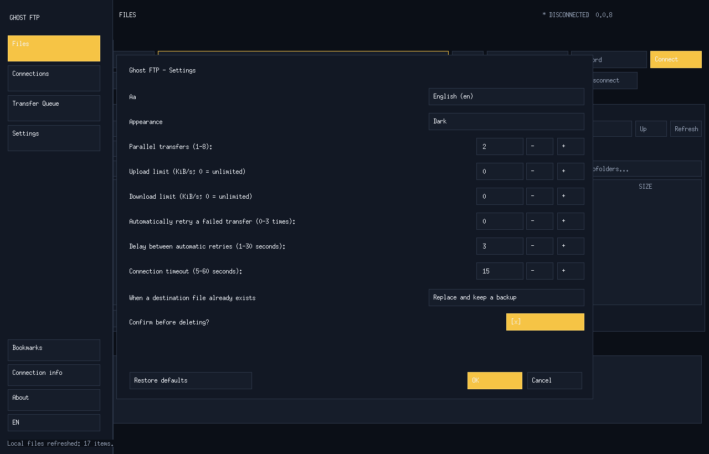
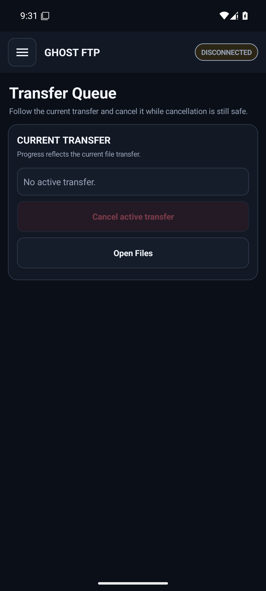

# Ghost FTP documentation

<p align="center"></p>
<p align="center"><strong>Product behavior, platform boundaries, privacy, security and release engineering for Ghost FTP.</strong></p>

## Current status

- Current source version: **0.0.8**
- Release channel: **Current**
- Product status: **Current**
- Protected baseline release: **0.0.7**
- 0.0.8 release target: `ghostftp-v0.0.8`, `PRERELEASE=false`
- 0.0.8 shape: **14 platform artifacts / 17 public files**
- Public release targets: **Windows, Linux, Android, macOS and browser helper packages**
- Maintained native source platforms: **Windows, Linux, Android and macOS**
- Browser packages: **Chrome, Edge, Firefox and Opera**
- Desktop languages: **24 selectable local languages**, English default/fallback
- Retired repository surfaces: **website and Web FTP**
- License: **proprietary commercial software, Brendigo LTD**

Version 0.0.8 is published only from exact verified `main` after the compatibility signing states, package set, checksums and remote readback all pass. Windows may be explicitly unsigned, Android may use a one-run compatibility certificate, and the macOS archive is ad-hoc signed; none of those states are presented as production publisher trust.

## Documentation principles

1. Describe what actually exists and what is actually published.
2. Security-sensitive boundaries fail closed.
3. CI/test identities never substitute for production signing identities.
4. Repository-local runtime screenshots are evidence only when bound to exact-head execution.
5. Privacy claims are scoped to each maintained product surface.
6. Retired website and Web FTP source, workflows, tests and documentation must remain absent.

## Start here

| Goal | Document |
| --- | --- |
| Install or run Ghost FTP | [`INSTALLATION.md`](INSTALLATION.md) |
| Product architecture | [`ARCHITECTURE.md`](ARCHITECTURE.md) |
| Platform capability boundaries | [`PLATFORM-PARITY.md`](PLATFORM-PARITY.md) |
| Security model | [`SECURITY.md`](SECURITY.md) |
| Privacy model | [`PRIVACY.md`](PRIVACY.md) |
| Signing identities | [`SIGNING.md`](SIGNING.md) |
| Release verification | [`RELEASE-VERIFICATION.md`](RELEASE-VERIFICATION.md) |
| GitHub publication flow | [`GITHUB-RELEASES.md`](GITHUB-RELEASES.md) |
| Packages / GHCR | [`PACKAGES.md`](PACKAGES.md) |
| Version lifecycle | [`VERSIONING.md`](VERSIONING.md) |
| Localization | [`LOCALIZATION.md`](LOCALIZATION.md) |
| Testing and quality gates | [`TESTING.md`](TESTING.md) |
| UI screenshots/evidence | [`REFERENCE-UI.md`](REFERENCE-UI.md) |
| Support | [`SUPPORT.md`](SUPPORT.md) |
| Linux | [`../linux/README.md`](../linux/README.md) |
| Android | [`../android/README.md`](../android/README.md) |
| macOS source | [`../macos/README.md`](../macos/README.md) |
| Browser helpers | [`../extensions/README.md`](../extensions/README.md) |
| Engineering audit prompt | [`prompts/GHOST-FTP-ENGINEERING-AUDIT-PROMPT.md`](prompts/GHOST-FTP-ENGINEERING-AUDIT-PROMPT.md) |

## 0.0.8 public artifact contract

```text
Ghost-FTP-0.0.8-Setup.exe
Ghost-FTP-0.0.8-Portable.exe
Ghost-FTP-0.0.8-Linux-Debian-Installer.run
Ghost-FTP-0.0.8-Linux-Debian-Portable.tar.gz
Ghost-FTP-0.0.8-Linux-Ubuntu-Installer.run
Ghost-FTP-0.0.8-Linux-Ubuntu-Portable.tar.gz
Ghost-FTP-0.0.8-Linux-Fedora-Installer.run
Ghost-FTP-0.0.8-Linux-Fedora-Portable.tar.gz
Ghost-FTP-0.0.8-Android.apk
Ghost-FTP-0.0.8-Chrome-Extension.zip
Ghost-FTP-0.0.8-Edge-Extension.zip
Ghost-FTP-0.0.8-Firefox-Extension.zip
Ghost-FTP-0.0.8-Opera-Extension.zip
BUILD-METADATA.txt
RELEASE-NOTES.txt
SHA256.txt
```

Canonical identity:

```text
VERSION=0.0.8
TAG=ghostftp-v0.0.8
CHANNEL=Current
PRERELEASE=false
PUBLIC_PLATFORM_ARTIFACTS=14
PUBLIC_RELEASE_FILES=17
```

Windows publishes exactly two architecture-independent user-facing EXEs containing x64/x86/ARM64 payloads. Linux publishes one Installer and one Portable bundle per Debian/Ubuntu/Fedora, each carrying amd64/arm64/i386 payloads. Android publishes one installable APK signed by the protected publisher identity when configured, otherwise by an ephemeral compatibility certificate. Browser helpers publish one deterministic ZIP each for Chrome, Edge, Firefox and Opera.

## Authentic visual reference

<table>
<tr><td width="50%"><strong>Windows workspace</strong><br></td><td width="50%"><strong>Windows Connections</strong><br></td></tr>
<tr><td width="50%"><strong>Linux workspace</strong><br></td><td width="50%"><strong>Linux Settings</strong><br></td></tr>
<tr><td width="50%"><strong>Android Files</strong><br></td><td width="50%"><strong>Android Transfer Queue</strong><br></td></tr>
</table>

Authentic runtime evidence is maintained across Windows, Linux and Android and must remain bound to an exact-head source SHA. The current 0.0.8 bundle contains 18 verified images (Windows 5, Linux 5, Android 8). macOS remains source/build validation until an authentic AppKit runtime capture is available; master references are never used as release evidence. Generated mockups are never accepted as execution or release evidence.

## Commercial proprietary license

Ghost FTP is not open-source software. Source visibility does not grant a general right to modify, redistribute, sublicense, rebrand or white-label the project. Ghost FTP is a copyrighted work of **Brendigo LTD** and is distributed under the repository's custom proprietary commercial [`LICENSE`](../LICENSE).


macOS public release artifact: `Ghost-FTP-0.0.8-macOS.app.zip`.
