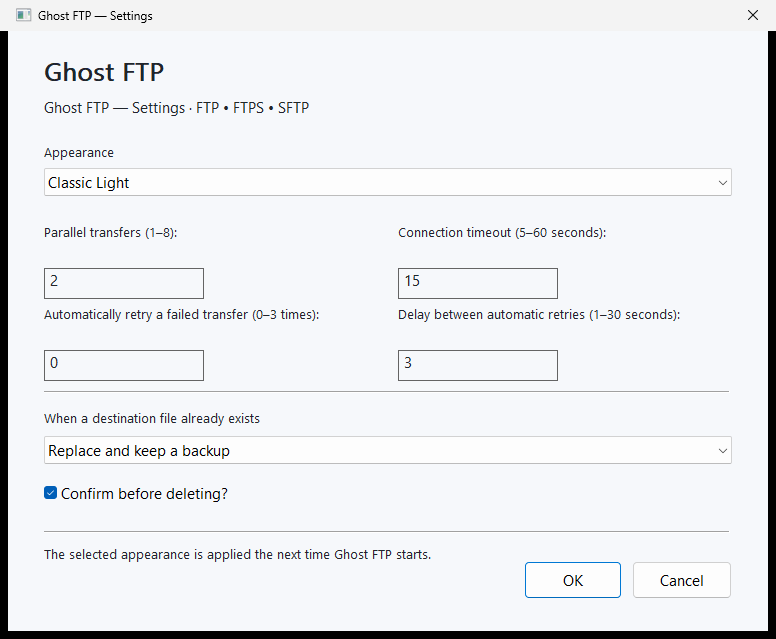
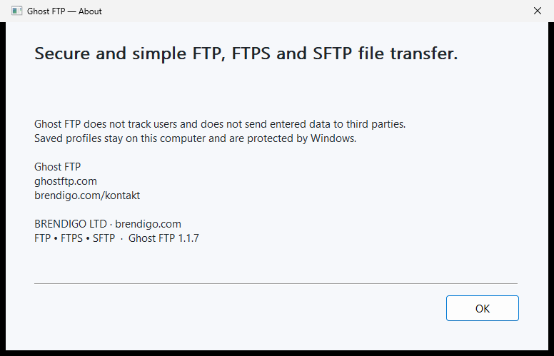

# Ghost FTP documentation

<p align="center">
  
</p>

- **Current Ghost FTP release: 1.1.8**
- Development status: **Stable**
- GitHub Release policy: **prerelease=false**
- Platforms: **Windows and Linux**
- Protocols: **FTP, FTPS and SFTP**
- Languages: **24 selectable local languages**
- Product website: **https://ghostftp.com**

The root [`VERSION`](../VERSION) file is the authoritative production version source. This directory contains maintained engineering, operations, privacy, security, release and user documentation for Ghost FTP.

## Authentic visual reference

The documentation icon and screenshots are repository-local. They do not load a remote badge, tracking pixel, icon CDN, webfont or analytics resource when the Markdown is rendered.

All four UI captures below come from the real production Windows x64 Portable executable and are maintained by the authentic screenshot workflow. They are evidence of application-owned native windows, not design mockups.

### Main Workspace


### Site Manager


### Settings



### About



See [`REFERENCE-UI.md`](REFERENCE-UI.md) for dimensions, SHA-256 provenance and the rules that prevent generated or stale replacement imagery from being treated as release evidence.

## Product and architecture

- [`ARCHITECTURE.md`](ARCHITECTURE.md) — component, protocol, persistence, transfer and release boundaries.
- [`REFERENCE-UI.md`](REFERENCE-UI.md) — maintained native workstation interaction and authentic screenshot reference.
- [`PLATFORM-PARITY.md`](PLATFORM-PARITY.md) — Windows/Linux behavior-parity contract.
- [`SETTINGS.md`](SETTINGS.md) — persisted settings, validation, normalization and recovery.
- [`LOCALIZATION.md`](LOCALIZATION.md) — 24-language local localization model.

## Installation and distribution

- [`INSTALLATION.md`](INSTALLATION.md) — Windows Setup/Portable and Linux installation/upgrade guidance.
- [`GITHUB-RELEASES.md`](GITHUB-RELEASES.md) — canonical GitHub Release structure and release-channel rules.
- [`PACKAGES.md`](PACKAGES.md) — Stable GHCR distribution bundle.
- [`RELEASE-VERIFICATION.md`](RELEASE-VERIFICATION.md) — artifact, metadata, SHA-256 and signing-state verification.
- [`SIGNING.md`](SIGNING.md) — optional protected Authenticode signing and truthful unsigned-release policy.
- [`VERSIONING.md`](VERSIONING.md) — semantic versioning and stable/prerelease rules.

Ghost FTP 1.1.8 preserves the canonical **12 platform artifacts / 15 public files** release shape: five Windows Setup/Portable files, three Linux DEBs, a Linux multiarch ZIP, three package-manager-neutral Linux tar.gz archives, release metadata, notes and `SHA256.txt`. The same verified release directory is mirrored to GitHub Packages as a non-runtime OCI distribution bundle.

Supplemental distro-specific CI packages built by `linux/BUILD-DISTROS.sh` cover Debian, Ubuntu, Fedora and a distro-neutral Portable family. Native lifecycle/GUI smoke verification is maintained for **Debian 13 amd64**, **Ubuntu 26.04 LTS amd64** and **Fedora 44 x86_64**. These supplemental packages are **not yet part of the canonical release allow-list**.

## Security and privacy

- [`SECURITY.md`](SECURITY.md) — transport security, secure defaults, SFTP trust, path validation, transfer staging, secret ownership and process boundaries.
- [`PRIVACY.md`](PRIVACY.md) — no-telemetry policy, local data handling, credential persistence and diagnostics redaction.
- [`DEPENDENCIES.md`](DEPENDENCIES.md) — dependency/runtime-tool policy and offline Go module boundary.
- [`THIRD-PARTY-NOTICES.md`](THIRD-PARTY-NOTICES.md) — notices for platform/runtime tooling.

## Quality and engineering

- [`TESTING.md`](TESTING.md) — Go race tests, loopback FTP regressions, native UI/runtime checks, distro lifecycle tests and repository audits.
- [`CONTRIBUTING.md`](CONTRIBUTING.md) — contribution and release-quality expectations.
- [`ROADMAP.md`](ROADMAP.md) — maintenance priorities and product constraints.
- [`SUPPORT.md`](SUPPORT.md) — support and privacy-safe issue reporting.
- [`prompts/GHOST-FTP-ENGINEERING-AUDIT-PROMPT.md`](prompts/GHOST-FTP-ENGINEERING-AUDIT-PROMPT.md) — production engineering, security, functional, UI/UX and release-audit handoff prompt.
- [`prompts/GHOSTFTP-COM-DARK-THEME-REDESIGN-PROMPT.md`](prompts/GHOSTFTP-COM-DARK-THEME-REDESIGN-PROMPT.md) — production build/redesign prompt for the official product website using the canonical Ghost FTP dark palette.

## Ghost FTP 1.1.8 contract

Ghost FTP 1.1.8 is a backward-compatible Windows/Linux Stable maintenance release candidate. Key changes include:

- privacy-safe child-process diagnostics with raw `curl`/OpenSSH diagnostic text neither exposed nor retained after classification;
- preserved FTP MLSD fallback through private semantic classification;
- root-controlled Linux transport executable provenance and fail-closed credential-bearing AskPass provenance;
- state-directory identity pinning against pathname replacement;
- Windows installer directory identity, shortcut ownership, legacy-uninstaller ownership and integrated-uninstall executable identity hardening;
- verified-handle exact-object shortcut/uninstall cleanup and preservation of unowned Start Menu parent structure;
- monitor-work-area-aware startup/minimum geometry, negative-origin support and destination-monitor mixed-DPI clamping;
- preserved FTPS validation, strict SFTP host-key verification/pinning, rooted filesystem/transfer protections and rollback semantics;
- no telemetry, analytics, advertising, tracking, hidden product service or new external Go module dependency.

## Stable publication

The 1.1.8 Stable identity is:

```text
ghostftp-v1.1.8
```

Windows artifacts:

```text
Ghost-FTP-1.1.8-Setup-x64.exe
Ghost-FTP-1.1.8-Setup-x86.exe
Ghost-FTP-1.1.8-Setup-x32.exe
Ghost-FTP-1.1.8-Portable-x64.exe
Ghost-FTP-1.1.8-Portable-x86.exe
```

Linux artifacts:

```text
Ghost-FTP-1.1.8-Linux-amd64.deb
Ghost-FTP-1.1.8-Linux-arm64.deb
Ghost-FTP-1.1.8-Linux-i386.deb
Ghost-FTP-1.1.8-Linux-multiarch.zip
Ghost-FTP-1.1.8-Linux-amd64.tar.gz
Ghost-FTP-1.1.8-Linux-arm64.tar.gz
Ghost-FTP-1.1.8-Linux-i386.tar.gz
```

GitHub Package:

```text
ghcr.io/bren-wp/ghost-ftp:1.1.8
```

Production Authenticode remains optional. If a trusted certificate is configured, Windows signatures are verified fail-closed. Otherwise the release is explicitly unsigned and `BUILD-METADATA.txt` records `WINDOWS_AUTHENTICODE=unsigned`; a generated/self-signed identity is never represented as a trusted production publisher.

## Historical 1.1.7 contract

The immutable 1.1.7 release remains historical at `ghostftp-v1.1.7` with the canonical **12 platform artifacts / 15 public files** shape. Ghost FTP 1.1.8 does not rewrite that tag, its assets, checksums, release notes or GHCR digest history. The older immutable 1.1.6 release retains its historical 9-platform-artifact / 12-public-file shape.

## Release history

- [`RELEASE-HISTORY.md`](RELEASE-HISTORY.md) — cumulative engineering narrative.
- [`../CHANGELOG.md`](../CHANGELOG.md) — public release change log used by release-note generation.

Historical version references describe their original release state and are not rewritten as current product behavior.

## Release verification rule

A release is complete only after the exact source revision passes Core, Windows, Linux and required distro gates and the immutable tag, GitHub Release asset set, `SHA256.txt`, metadata and Stable GitHub Package have all been read back successfully.

Canonical publication uses `release/ghostftp-vX.Y.Z` created only from the exact post-merge `main` SHA that passed the complete quality gate. A push to `main` does not itself publish a release.

## UI evidence rule

A public Windows UI/version change requires authentic screenshots from the real production Windows x64 Portable executable for Main Workspace, Site Manager, Settings and About. Mockups or generated approximations are not accepted as release evidence.

## Privacy-safe documentation rule

Documentation and build logs must never contain real passwords, private-key passphrases, protected profile payloads, signing private keys or private user data. Examples use synthetic values only. Rendered documentation media is repository-local; externally hosted images, badge images, tracking pixels, remote icon resources and remote webfont/image dependencies are not permitted in the active documentation surface.
