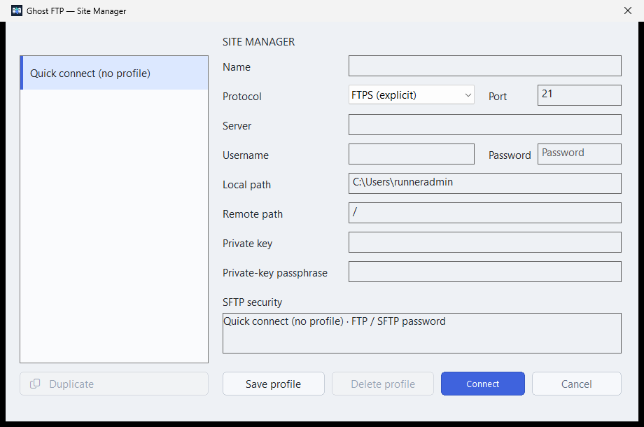
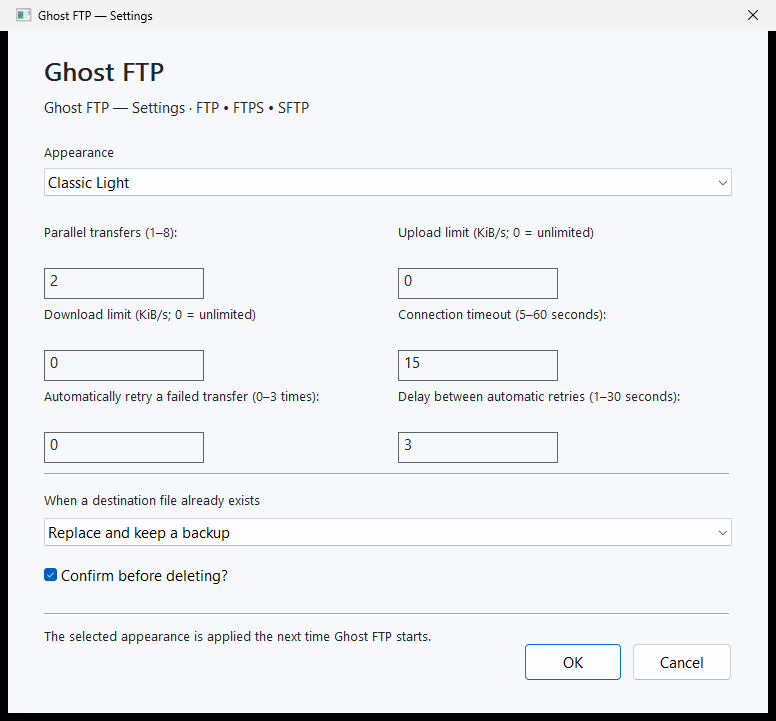
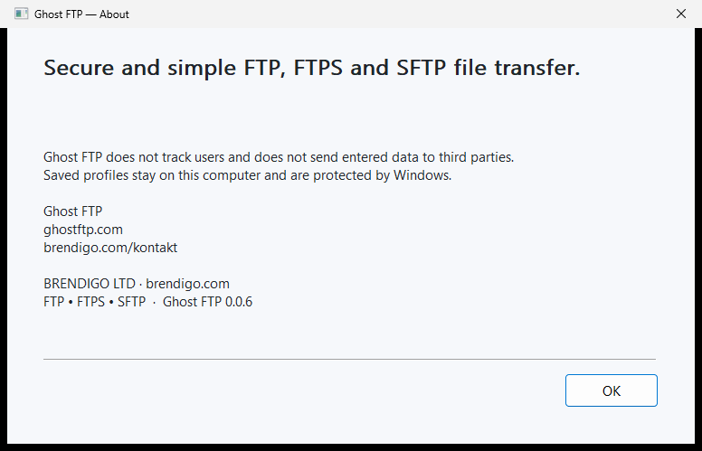

# Ghost FTP native reference UI

Ghost FTP **0.0.7** uses focused native two-pane desktop layouts on Windows and Linux, a public purpose-built Android workspace, and a separately validated native macOS development frontend.

This is a source/runtime contract, not a mockup specification. Visible controls must map to real capability and state. Windows remains the canonical desktop visual/behavior reference; Linux uses native X11/XWayland-compatible presentation while sharing engine/security/transfer semantics.

## Canonical desktop workspace

The maintained desktop hierarchy consists of application/profile actions, Quick Connect, Local and Remote file panes, transfer actions, transfer queue and restrained status/version surfaces. Remote file management includes **Remote Edit** for supported regular text files.

## Appearance contract

Classic Light uses workspace `#EEF1F5`, panel `#F6F8FB` and list `#FAFBFD`. It deliberately avoids pure white as the dominant application surface.

Dark uses workspace `#0B0F17`, panel `#121824` and list `#161D2A`. Both palettes are local source data; no remote stylesheet, font, theme or analytics service is loaded.

## Native dialog and lifecycle contract

Ghost FTP-owned Windows dialogs visually belong to the active appearance and must not terminate the application message loop when they close. Only the main desktop window owns process-level `WM_QUIT`/`PostQuitMessage` lifecycle.

Closing bounded dialogs such as **Nova mapa**, **Preimenuj**, **Postavke**, **Dijagnostika** or **O programu** closes only that dialog/session surface. Nested modal loops preserve a received process shutdown request instead of swallowing it.

Windows Settings is one application-owned modal surface for appearance, concurrency, **independent upload/download bandwidth ceilings**, connection timeout, retry policy, destination conflict policy and delete confirmation. Bandwidth fields use `KiB/s` with `0 = unlimited`.

Linux modal overlays own only their bounded lifecycle. macOS uses native AppKit windows/sheets and must not create parallel engine state.

## Site Manager and saved profiles



Site Manager/profile workflows preserve explicit credential-consent and trust semantics. Windows and Linux save non-secret profile state independently from newly entered credentials; protected durable secret paths remain platform-specific.

## Main Workspace


Actions are enabled from real state. Disabled operations remain disabled regardless of button, menu, list gesture or keyboard route. Stale async callbacks are rejected through connection/session identity.

## File panes and transfer queue

Maintained desktop panes share sorting for Name, Type, Size and Modified plus remote Permissions where available. Directories remain first and filter+sort operates over authoritative loaded snapshots.

Pause/resume/cancel/retry/clear use the transfer manager. Queued **Top / Up / Down / Bottom** actions reorder queued scheduler slots only. Progress/speed/ETA are displayed only when backed by real state.

0.0.6 retains Windows local/remote mutation re-entry guards and connection-generation binding so stale callbacks cannot update a replacement session.

## Built-in Remote Editor

Remote Edit remains compact: Edit, Save, Reload, Close, dirty-state indication and conflict/error status. Maintained implementations preserve strict UTF-8/binary boundaries, revision/conflict checks, staged commit/read-back behavior and lifecycle ownership.

## Windows universal package and evidence boundary

The two public Windows downloads are:

```text
Ghost-FTP-0.0.6-Setup.exe
Ghost-FTP-0.0.6-Portable.exe
```

They embed verified native **x64, x86 and ARM64** payloads. The x86 bootstrap selects the native processor through `GetNativeSystemInfo`, verifies staged bytes and performs no runtime architecture download.

```text
WINDOWS_NATIVE_PAYLOADS=x64,x86,arm64
WINDOWS_ARM64_RUNTIME_EVIDENCE=not-native-ci
WINDOWS_AUTHENTICODE=signed
```

Authentic Windows screenshots prove the UI on the maintained runner architecture, not native ARM64 execution. Native ARM64 runtime claims require a maintained ARM64 runner/device and source-bound evidence.

## Linux native workspace


Linux uses the same typed engine and security/transfer contracts as Windows, with native X11/XWayland-compatible presentation. Canonical Debian/Ubuntu/Fedora/Portable packages retain package metadata, extraction and binary-parity gates; maintained native lifecycle evidence is x86-64 only.

## Android native workspace


Android 0.0.7 is a public native application exposing **Files**, **Sites**, **Bookmarks**, **Transfers**, **Settings** and **About** plus semantic navigation. Small screens use a drawer and wider layouts a visible sidebar; system-bar insets keep controls outside reserved system UI.

Android supports FTP and strict explicit FTPS. Local access uses Storage Access Framework capabilities; saved sites contain non-secret connection/navigation metadata; file operations/search/comparison/Remote Edit and transfers remain bounded and lifecycle-owned. SFTP remains absent until strict maintained host-key identity verification exists.

## macOS native development workspace

The AppKit frontend uses the shared `internal/api.Engine` and a universal development build. This is development/source evidence only. Public macOS distribution requires the dedicated Developer ID signing/notarization path to succeed with real protected Apple credentials.

## Browser helper boundary

Chrome, Edge, Firefox and Opera helper packages are public 0.0.7 companions. They use one canonical shared runtime, request no broad browser/network permissions and have no supported browser-to-desktop launch/handoff.

## Settings and About evidence





About displays product/version identity generated from canonical build `VERSION`; the maintained current public identity is **Ghost FTP 0.0.7**.

## Authentic screenshot evidence

`.github/workflows/ui-screenshots.yml` captures real exact-head runtime UI. **Mockups, image-generation output and manually composed approximations are not accepted** as production UI evidence. The capture workflow does **not** commit or push screenshots; repository media is imported only from a separately verified evidence bundle.

The immutable 0.0.6 evidence set stored in [`images/0.0.6/`](images/0.0.6/) contains exactly:

- Windows — 5 images: Main Workspace, Site Manager, Bookmarks, Settings, About;
- Linux — 3 images: Main Workspace, Bookmarks, Settings;
- Android — 7 images: Files, Navigation, Sites, Bookmarks, Transfers, Settings, About.

The stored [`UI-SCREENSHOT-PROVENANCE.json`](images/0.0.6/UI-SCREENSHOT-PROVENANCE.json) records workflow run `34863585111`, capture source SHA `9adace20030a300c39eb320a97482eb50dfdb9d8`, image byte counts and SHA-256 digests. [`SHA256.txt`](images/0.0.6/SHA256.txt) provides a compact digest allow-list for repository verification.

The immutable 0.0.6 repository set above remains a **15-image historical evidence snapshot**. The current exact-head capture contract adds Linux **Connection info** and **About**, so the live verifier now requires exactly **17 runtime images**: Windows 5, Linux 5 and Android 7. It verifies source/workflow identity, filenames, byte counts and SHA-256, and emits the read-only `ghostftp-authentic-ui-verified-bundle`. The repository copy is imported only after those checks pass and is not a substitute for the original workflow artifact.

Legacy unversioned documentation images may remain for historical links, but the **0.0.6 README and reference documentation must use `images/0.0.6/`** so later releases cannot silently replace the evidence presented for 0.0.6.

See [Settings](SETTINGS.md), [Platform parity](PLATFORM-PARITY.md), [Testing](TESTING.md), [Privacy](PRIVACY.md) and [`../macos/README.md`](../macos/README.md).
